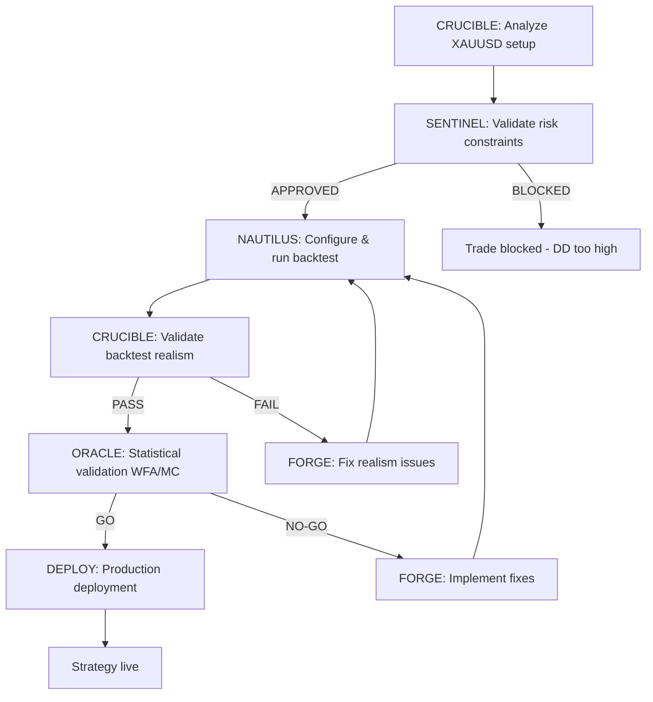

# Droid Ecosystem Health Framework (LAYER 5)

## Executive Summary
- **Versioning**: Central registry in AGENTS.md `<droid_versions>` (17 droids tracked)
- **Quality gates**: Post-refactoring validation with functional tests (prevent regression)
- **Observability**: Metrics dashboard tracking usage, errors, performance, quality
- **Dependency graph**: 3 workflows documented (Strategy Dev, Code Review, Research→Design)
- **Orchestrator**: ea-scalper-xauusd-orchestrator elevated to MAESTRO role (priority 7)

---

## 1. Versioning & Tracking

### Version Registry (Add to AGENTS.md)

```xml
<droid_versions>
  <description>
    Central registry of all droid versions. Updated after each refactoring.
    Used to ensure sessions use latest versions and track evolution.
  </description>
  
  <!-- TOP 5 (Refactored in Phase 1) -->
  <droid name="NAUTILUS" current_version="2.1" status="refactored" date="2025-12-07">
    <file>.factory/droids/nautilus-trader-architect.md</file>
    <size>36KB</size>
    <previous_size>53KB</previous_size>
    <reduction>32%</reduction>
    <changelog>
      <version number="2.1">Inheritance from AGENTS.md v3.4.1, token reduction, 3 additional questions</version>
      <version number="2.0">Initial full version with all protocols</version>
    </changelog>
  </droid>
  
  <droid name="ORACLE" current_version="2.1" status="refactored" date="2025-12-07">
    <file>.factory/droids/oracle-backtest-commander.md</file>
    <size>19KB</size>
    <previous_size>38KB</previous_size>
    <reduction>50%</reduction>
    <changelog>
      <version number="2.1">Inheritance from AGENTS.md v3.4.1, statistical thresholds focus</version>
      <version number="2.0">Initial version</version>
    </changelog>
  </droid>
  
  <droid name="FORGE" current_version="2.1" status="refactored" date="2025-12-07">
    <file>.factory/droids/forge-mql5-architect.md</file>
    <size>19KB</size>
    <previous_size>37KB</previous_size>
    <reduction>49%</reduction>
    <changelog>
      <version number="2.1">Inheritance, Python/Nautilus anti-patterns focus, Context7 integration</version>
      <version number="2.0">Initial version</version>
    </changelog>
  </droid>
  
  <droid name="SENTINEL" current_version="2.1" status="refactored" date="2025-12-07">
    <file>.factory/droids/sentinel-apex-guardian.md</file>
    <size>24KB</size>
    <previous_size>37KB</previous_size>
    <reduction>35%</reduction>
    <changelog>
      <version number="2.1">Inheritance, Apex Trading formulas focus, circuit breaker levels</version>
      <version number="2.0">Initial version</version>
    </changelog>
  </droid>
  
  <droid name="RESEARCH-ANALYST-PRO" current_version="2.1" status="refactored" date="2025-12-07">
    <file>.factory/droids/research-analyst-pro.md</file>
    <size>17KB</size>
    <previous_size>31KB</previous_size>
    <reduction>45%</reduction>
    <changelog>
      <version number="2.1">Inheritance, triangulation methodology focus, confidence frameworks</version>
      <version number="2.0">Initial version</version>
    </changelog>
  </droid>
  
  <!-- CRITICAL (Refactor in Phase 1) -->
  <droid name="ORCHESTRATOR" current_version="3.0" status="maestro_elevated" date="2025-12-08">
    <file>.factory/droids/ea-scalper-xauusd-orchestrator.md</file>
    <size>15KB</size>
    <previous_size>20KB</previous_size>
    <reduction>25%</reduction>
    <role>MAESTRO (priority 7 in decision_hierarchy)</role>
    <changelog>
      <version number="3.0">Elevated to MAESTRO, workflow DAG added, automatic invocation, conflict mediation</version>
      <version number="2.0">Coordination logic, routing table</version>
      <version number="1.0">Initial version</version>
    </changelog>
  </droid>
  
  <droid name="ONNX-MODEL-BUILDER" current_version="2.0" status="refactored" date="2025-12-08">
    <file>.factory/droids/onnx-model-builder.md</file>
    <size>13KB</size>
    <previous_size>20KB</previous_size>
    <reduction>35%</reduction>
    <changelog>
      <version number="2.0">Inheritance, ML pipeline focus, ORACLE integration</version>
      <version number="1.0">Initial version</version>
    </changelog>
  </droid>
  
  <!-- REMAINING (Refactor in Phase 2-3) -->
  <droid name="CRUCIBLE" current_version="1.0" status="pending" date="TBD">
    <file>.factory/droids/crucible-gold-strategist.md</file>
    <size>10KB</size>
    <phase>2</phase>
  </droid>
  
  <droid name="ARGUS" current_version="1.0" status="pending" date="TBD">
    <file>.factory/droids/argus-quant-researcher.md</file>
    <size>15KB</size>
    <phase>2</phase>
  </droid>
  
  <droid name="generic-code-reviewer" current_version="2.0" status="merged" date="TBD">
    <file>.factory/droids/generic-code-reviewer.md</file>
    <size>10KB</size>
    <merged_from>code-architect-reviewer + senior-code-reviewer</merged_from>
    <phase>2</phase>
  </droid>
  
  <!-- GAP DROIDS (Create in Phase 1-2) -->
  <droid name="security-compliance-guardian" current_version="1.0" status="to_create" date="TBD">
    <file>.factory/droids/security-compliance-guardian.md</file>
    <size>~12KB (estimated)</size>
    <phase>1</phase>
    <priority>CRITICAL</priority>
  </droid>
  
  <droid name="performance-optimizer" current_version="1.0" status="to_create" date="TBD">
    <file>.factory/droids/performance-optimizer.md</file>
    <size>~14KB (estimated)</size>
    <phase>1</phase>
    <priority>HIGH</priority>
  </droid>
  
  <!-- Additional droids... -->
</droid_versions>
```

### Version Checking Protocol

**Add to session initialization**:
1. When Task agent invokes droid, check `<droid_versions>` for current_version
2. Load droid file from specified path
3. Verify version metadata in droid file matches registry
4. If mismatch → WARN user + suggest update

---

## 2. Quality Gates

### Post-Refactoring Validation

**Protocol**: For EACH refactored droid, run quality gate before marking complete

```yaml
quality_gate:
  name: Post-Refactoring Validation
  trigger: After droid refactoring completed
  
  checks:
    1_size_reduction:
      requirement: Size reduction ≥50% (target: 60-70%)
      method: Compare file size before vs after
      failure_action: Re-evaluate what to remove
    
    2_domain_knowledge_preservation:
      requirement: Domain knowledge similarity >95%
      method: Semantic comparison of domain_knowledge sections
      failure_action: Add back missing domain knowledge
    
    3_functional_tests:
      requirement: All test tasks produce semantically similar output
      method: Invoke droid with test tasks, compare before/after
      failure_action: Fix implementation until tests pass
    
    4_inheritance_validation:
      requirement: <inheritance> section present, references AGENTS.md v3.4.1
      method: Parse XML, verify structure
      failure_action: Add missing inheritance section
    
    5_additional_questions:
      requirement: Exactly 3 additional_reflection_questions
      method: Count questions in section
      failure_action: Add missing questions or remove extras
```

### Test Tasks per Droid

```yaml
test_tasks:
  NAUTILUS:
    - "Explain Actor vs Strategy pattern in NautilusTrader"
    - "How to migrate MQL5 OnTick() to Nautilus?"
    - "What's the performance budget for on_bar handler?"
  
  ORACLE:
    - "What's the WFE threshold for GO decision?"
    - "Explain Walk-Forward Efficiency calculation"
    - "How many Monte Carlo runs required?"
  
  FORGE:
    - "How to avoid blocking in on_bar handler?"
    - "What's the Deep Debug protocol?"
    - "How to use pytest fixtures for NautilusTrader?"
  
  SENTINEL:
    - "Calculate trailing DD with unrealized P&L"
    - "What's the circuit breaker level at 8.5% DD?"
    - "Explain position sizing formula with time multiplier"
  
  RESEARCH:
    - "What confidence level for single arXiv paper?"
    - "Explain multi-source triangulation methodology"
    - "How to rate source credibility?"
```

### Continuous Quality Monitoring

**Add to AGENTS.md**:

```xml
<quality_monitoring>
  <description>
    Track droid health metrics to ensure ecosystem quality over time.
    Stored in memory MCP knowledge graph for analytics.
  </description>
  
  <metrics>
    <metric name="droid_invocation_count">
      Track how often each droid is used (detect unused droids for removal)
    </metric>
    <metric name="droid_error_rate">
      Track failures per droid (detect quality issues)
    </metric>
    <metric name="droid_avg_execution_time">
      Track performance (detect slow droids needing optimization)
    </metric>
    <metric name="droid_output_quality">
      User feedback on output quality (1-5 stars, thumbs up/down)
    </metric>
  </metrics>
  
  <storage>
    <location>memory MCP - knowledge graph</location>
    <entity type="droid_invocation">
      <attributes>
        droid_name, timestamp, task_summary, execution_time_seconds,
        status (success/failure), output_length_chars, user_feedback (1-5)
      </attributes>
    </entity>
  </storage>
  
  <reporting frequency="weekly">
    <file>DOCS/04_REPORTS/DROID_METRICS_DASHBOARD.md</file>
    <contents>
      - Most used droids (top 10)
      - Highest error rate droids (need fixes)
      - Slowest droids (need optimization)
      - Lowest rated droids (need improvement)
      - Unused droids (consider removal)
    </contents>
  </reporting>
  
  <alerts>
    <alert condition="error_rate > 2%">Investigate droid quality issues</alert>
    <alert condition="avg_execution_time > 30s">Optimize droid performance</alert>
    <alert condition="quality_score < 4.0">Improve droid output quality</alert>
    <alert condition="invocation_count = 0 for 30 days">Consider removing unused droid</alert>
  </alerts>
</quality_monitoring>
```

---

## 3. Dependency Graph (DAG)

### Workflow 1: Strategy Development & Deployment



**Add to AGENTS.md**:

```xml
<dependency_graph>
  <workflow name="Strategy Development & Deployment" id="workflow_1">
    <description>From setup analysis to live deployment</description>
    
    <step order="1" droid="CRUCIBLE" output="setup_analysis.md">
      Analyze XAUUSD setup, calculate confluence score, identify entry/exit
    </step>
    
    <step order="2" droid="SENTINEL" input="setup_analysis.md" output="risk_decision.md">
      Validate risk constraints (DD, time to 4:59 PM, consistency)
      <veto_condition>DD >9% OR time <30min OR consistency >30%</veto_condition>
      <if_veto>BLOCK trade, END workflow</if_veto>
    </step>
    
    <step order="3" droid="NAUTILUS" input="setup_analysis.md" output="backtest_results.json">
      Configure backtest (ParquetDataCatalog, BacktestNode, FillModel, LatencyModel)
      Run backtest, produce results
    </step>
    
    <step order="4" droid="CRUCIBLE" input="backtest_results.json" output="realism_validation.md">
      Validate backtest realism (25 gates: slippage, spread, fills)
      <if_fail>BLOCK, request fixes from FORGE</if_fail>
    </step>
    
    <step order="5" droid="ORACLE" input="backtest_results.json" output="validation_report.md">
      Statistical validation (WFA, Monte Carlo, GO/NO-GO)
      <go_criteria>WFE ≥0.6, DSR >0, MC_95th_DD <5%</go_criteria>
      <if_no_go>Request fixes from FORGE, loop to step 3</if_no_go>
    </step>
    
    <step order="6" droid="FORGE" input="validation_report.md" output="fixes_implemented">
      Implement fixes based on ORACLE/CRUCIBLE feedback
      <condition>Only if step 4 or 5 failed</condition>
      <after_fixes>Loop back to step 3 (NAUTILUS re-test)</after_fixes>
    </step>
    
    <step order="7" droid="deployment-devops" input="validation_report.md" output="deployed">
      Deploy to production (blue-green, smoke tests)
      <condition>Only if ORACLE says GO</condition>
      <optional>Gap 5 droid (may not exist yet)</optional>
    </step>
  </workflow>
  
  <workflow name="Code Review & Refactoring" id="workflow_2">
    <description>From code analysis to validated refactoring</description>
    
    <step order="1" droid="FORGE" output="code_analysis.md">
      Analyze code, identify issues (anti-patterns, performance, testing gaps)
    </step>
    
    <step order="2" droid="NAUTILUS" input="code_analysis.md" output="architecture_review.md">
      Review architecture, suggest high-level changes
      <condition>Only if code_analysis mentions architecture issues</condition>
    </step>
    
    <step order="3" droid="FORGE" input="architecture_review.md" output="refactored_code">
      Implement refactoring based on NAUTILUS suggestions
    </step>
    
    <step order="4" droid="ORACLE" input="refactored_code" output="regression_test_results">
      Run regression tests to ensure no breakage
      <condition>If tests exist</condition>
    </step>
  </workflow>
  
  <workflow name="Research → Strategy Design" id="workflow_3">
    <description>From research to implemented strategy</description>
    
    <step order="1" droid="ARGUS" output="research_findings.md">
      Research trading concepts, ML algos, market microstructure
    </step>
    
    <step order="2" droid="onnx-model-builder" input="research_findings.md" output="ml_model.onnx">
      Train ML model based on research findings
      <condition>If research mentions ML approach</condition>
    </step>
    
    <step order="3" droid="CRUCIBLE" input="research_findings.md,ml_model.onnx" output="strategy_design.md">
      Design strategy incorporating research + ML model
    </step>
    
    <step order="4" droid="NAUTILUS" input="strategy_design.md" output="strategy_implementation.py">
      Implement strategy in NautilusTrader (Strategy or Actor)
    </step>
    
    <step order="5" droid="ORACLE" input="strategy_implementation.py" output="backtest_validation.md">
      Backtest and validate (loop back to workflow_1 step 3)
    </step>
  </workflow>
</dependency_graph>
```

---

## 4. Orchestrator Enhancements (MAESTRO Role)

### Upgrade ea-scalper-xauusd-orchestrator.md

**Current capabilities**:
- Routes based on trigger keywords (manual user invocation)
- Coordinates handoffs between droids
- Enforces Apex constraints

**MAESTRO enhancements** (to be added):

```yaml
maestro_enhancements:
  1_workflow_knowledge:
    description: Knows the 3 dependency graph workflows
    capability: Can automatically invoke droids in correct DAG order
    example: "User: backtest new strategy" → Auto-invoke: CRUCIBLE → SENTINEL → NAUTILUS → ORACLE
  
  2_automatic_invocation:
    description: Detects user intent and auto-executes workflow
    capability: No need for user to manually invoke each droid
    example: "User: validate this backtest" → Auto-invoke: CRUCIBLE → ORACLE (skip setup)
  
  3_conditional_logic:
    description: Handles "only if X" conditions in workflows
    capability: Skip steps based on conditions
    example: "If CRUCIBLE blocks (unrealistic) → invoke FORGE, else → ORACLE"
  
  4_loop_handling:
    description: Implements fix → re-test → validate loops
    capability: Auto-loop until GO condition met
    example: "ORACLE says NO-GO → FORGE fixes → NAUTILUS re-tests → ORACLE re-validates (loop)"
  
  5_conflict_mediation:
    description: Applies decision_hierarchy and conflict_resolution protocol
    capability: Resolves droid disagreements automatically
    example: "CRUCIBLE vs ORACLE conflict → Apply priority 2 > 3 → ORACLE wins"
  
  6_progress_reporting:
    description: Transparent status updates to user
    capability: "Step 3/7: NAUTILUS running backtest... ETA 2 min"
    example: "Workflow 1: CRUCIBLE ✅ → SENTINEL ✅ → NAUTILUS ⏳ → ORACLE ⏸️"
  
  7_opt_in_mode:
    description: User can enable/disable automatic workflow execution
    capability: "maestro auto" (default) or "maestro manual" (original behavior)
    example: "User: maestro auto" → Future requests auto-execute workflows
```

**Add to orchestrator.md**:
- Reference to 3 workflows in `<dependency_graph>`
- Automatic invocation logic (intent detection → workflow selection)
- Progress reporting template
- Opt-in/opt-out commands

---

## 5. Observability

### Logging Standard

**All droids must log to structured format**:

```json
{
  "timestamp": "2025-12-07T18:30:00Z",
  "droid": "NAUTILUS",
  "version": "2.1",
  "task": "Explain Actor vs Strategy pattern",
  "execution_time_seconds": 4.2,
  "thinking_score": 0.82,
  "reflection_questions_applied": 10,
  "status": "success",
  "output_length_chars": 2345,
  "user_feedback": null
}
```

### Metrics Dashboard Template

**Create**: `DOCS/04_REPORTS/DROID_METRICS_DASHBOARD.md` (updated weekly)

```markdown
# Droid Ecosystem Metrics Dashboard

**Period**: 2025-12-01 to 2025-12-07

## Usage Statistics

| Droid | Invocations | Avg Exec Time | Error Rate | Avg Quality |
|-------|-------------|---------------|------------|-------------|
| FORGE | 45 | 5.2s | 2.2% | 4.3/5 |
| ORACLE | 32 | 8.7s | 0% | 4.8/5 |
| SENTINEL | 28 | 2.1s | 0% | 4.9/5 |
| NAUTILUS | 18 | 12.3s | 5.6% | 4.1/5 |
| CRUCIBLE | 15 | 6.5s | 0% | 4.6/5 |
| ARGUS | 8 | 45.2s | 12.5% | 3.8/5 |
| ORCHESTRATOR | 2 | 3.5s | 0% | N/A |

## Red Flags

🚨 **NAUTILUS error rate 5.6%** (target: <2%)
- Root cause: Migration logic failing on complex MQL5 patterns
- Action: Add test cases, improve error handling

🚨 **ARGUS slow execution 45.2s** (target: <30s)
- Root cause: Sequential web searches (not parallel)
- Action: Parallelize research tool calls

🚨 **ARGUS low quality 3.8/5** (target: >4.0)
- Root cause: Too many low-confidence sources
- Action: Improve source filtering

## Recommendations

1. Fix NAUTILUS error rate (add MQL5 migration test suite)
2. Optimize ARGUS (parallelize, better source filtering)
3. Monitor FORGE (highest usage, ensure quality doesn't degrade)
```

---

## Recommendations for AGENTS.md Updates

1. **Add** `<droid_versions>` section (17 droids with versions, sizes, changelogs)
2. **Add** `<quality_monitoring>` section (metrics, storage, reporting, alerts)
3. **Add** `<dependency_graph>` section (3 workflows: Strategy Dev, Code Review, Research→Design)
4. **Expand** `<decision_hierarchy>` to 7 levels (add CRUCIBLE, NAUTILUS, FORGE, ARGUS, ORCHESTRATOR)
5. **Add** versioning check protocol to session initialization

---

## Key Insights

1. **Versioning prevents drift** - Central registry ensures everyone uses latest versions
2. **Quality gates prevent regression** - Post-refactoring validation catches domain knowledge loss
3. **Observability enables improvement** - Metrics dashboard reveals patterns (slow droids, high error rates)
4. **Dependency graph enables automation** - ORCHESTRATOR can auto-execute workflows
5. **MAESTRO elevation is critical** - Transforms manual coordination into automatic orchestration

---

**Next**: Generate primary XML report consolidating all 5 layers + update SUMMARY.md to v2.0.
