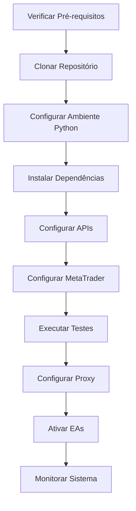

# 📚 Documentação de Instalação - EA_SCALPER_XAUUSD

## 🎯 Visão Geral

Bem-vindo à documentação completa de instalação do sistema EA_SCALPER_XAUUSD! Este repositório contém guias detalhados para instalação, configuração e uso do sistema de trading automatizado.

## 📋 Estrutura dos Guias

| Guia | Descrição | Tempo Estimado |
|------|-----------|----------------|
| [🚀 Quick Start](05-quick-start.md) | Guia rápido para iniciantes | 15 minutos |
| [⚙️ Instalação Completa](01-instalacao-completa.md) | Instalação detalhada para todos os ambientes | 45-60 minutos |
| [🔧 Configuração Inicial](02-configuracao-inicial.md) | Configuração completa do sistema | 30-45 minutos |
| [📊 Uso Diário](03-uso-diario.md) | Rotina diária de operação | Guia de referência |
| [🔧 Troubleshooting](04-troubleshooting.md) | Solução de problemas | Consulta rápida |

---

## 🚀 Por Onde Começar?

### Se você é iniciante (recomendado):
1. **Quick Start Guide** - Comece aqui se quer usar o sistema rapidamente
2. **Instalação Completa** - Após o quick start, aprofunde-se na instalação
3. **Configuração Inicial** - Configure todas as funcionalidades do sistema
4. **Uso Diário** - Aprenda a operar o sistema no dia a dia

### Se você é experiente:
1. **Instalação Completa** - Instalação detalhada para todos os ambientes
2. **Configuração Inicial** - Configuração avançada
3. **Uso Diário** - Operação e otimização
4. **Troubleshooting** - Resolução de problemas

---

## 📋 Pré-requisitos Mínimos

### Software Essencial
- **Python 3.11+**
- **Git 2.30+**
- **MetaTrader 5** (ou MetaTrader 4)

### Hardware Mínimo
- **Processador**: 2 núcleos
- **Memória RAM**: 4 GB
- **Armazenamento**: 10 GB livres
- **Rede**: 1 Mbps

### APIs e Contas
- **OpenRouter API Key** (gratuita)
- **Conta Demo** no MetaTrader
- **GitHub** (opcional, para backup)

---

## 🎯 Sistema Operacional Suportado

| Sistema | Status | Notas |
|---------|--------|-------|
| Windows 10/11 | ✅ Completo | Recomendado para MetaTrader |
| Ubuntu 20.04+ | ✅ Completo | Com algumas limitações |
| Debian 11+ | ✅ Completo | Testado em Debian 11 |
| macOS 11+ | ✅ Parcial | Requer Parallels/Boot Camp |

---

## 🔄 Fluxo de Instalação Recomendado

---

## 📊 Componentes do Sistema

### 1. **Especialistas Advisors (EAs)**
- EA_FTMO_SCALPER_ELITE
- Estratégias de scalping para XAUUSD
- Risk management integrado

### 2. **Sistema Multi-Agente**
- Classificador automático de código
- Sistema de otimização
- Agentes de análise

### 3. **Proxy Server**
- Conexão com OpenRouter
- Cache inteligente
- Rate limiting

### 4. **MCP Servers**
- Integração com Claude Code
- Code checker automatizado
- GitHub integration

### 5. **Scripts de Automação**
- Backup automático
- Geração de relatórios
- Monitoramento

---

## 🛠️ Ferramentas Incluídas

### Desenvolvimento
- **Python 3.11+**
- **MCP Framework**
- **Claude Code Integration**
- **MetaTrader 5 Python API**

### Análise
- **Classificador automático**
- **Sistema de backtest**
- **Otimização de parâmetros**
- **Análise de performance**

### Automação
- **Backup automático**
- **Monitoramento em tempo real**
- **Relatórios diários/semanais**
- **Alertas configuráveis**

---

## 📈 Níveis de Configuração

### Básico (Quick Start)
- ✅ Proxy server funcional
- ✅ EA básico operacional
- ✅ Monitoramento simples

### Intermediário (Completo)
- ✅ Todos os EAs configurados
- ✅ Sistema multi-agente ativo
- ✅ MCP servers funcionando
- ✅ Automação básica

### Avançado (Produção)
- ✅ Otimização contínua
- ✅ Multi-conta
- ✅ Análise avançada
- ✅ Backup completo

---

## 🎓 Cursos de Aprendizagem

### Módulo 1: Fundamentos (Semana 1)
1. Instalação e configuração básica
2. Entendimento do MetaTrader
3. Noções de trading com EAs
4. Risk management essencial

### Módulo 2: Operação (Semana 2-3)
1. Uso diário do sistema
2. Análise de resultados
3. Ajustes de parâmetros
4. Monitoramento avançado

### Módulo 3: Otimização (Semana 4+)
1. Backtest e forward test
2. Otimização de parâmetros
3. Análise multi-tempo
4. Estratégias avançadas

---

## 📞 Suporte e Comunidade

### Autoajuda
- 📖 **Documentação**: Guias completos aqui
- 🔧 **Troubleshooting**: Solução de problemas
- 📊 **FAQ**: Perguntas frequentes

### Comunidade
- 💬 **Discord**: Link no README principal
- 🐛 **GitHub Issues**: Reportar bugs
- 📧 **Email**: suporte (se disponível)

### Recursos Adicionais
- 🎥 **Vídeos Tutoriais** (em desenvolvimento)
- 📝 **Blog** com dicas semanais
- 🔄 **Updates** semanais do sistema

---

## 📋 Checklist Completo de Instalação

### Fase 1: Preparação (5 minutos)
- [ ] Verificar sistema operacional compatível
- [ ] Confirmar requisitos de hardware
- [ ] Obter conta OpenRouter
- [ ] Configurar conta demo MetaTrader

### Fase 2: Instalação (15 minutos)
- [ ] Clonar repositório completo
- [ ] Configurar ambiente virtual Python
- [ ] Instalar todas as dependências
- [ ] Configurar arquivo .env
- [ ] Executar testes básicos

### Fase 3: Configuração (20 minutos)
- [ ] Configurar MetaTrader 5
- [ ] Compilar EAs
- [ ] Configurar proxy server
- [ ] Configurar MCP servers (se usado)
- [ ] Testar integrações

### Fase 4: Validação (10 minutos)
- [ ] Testar conexão com APIs
- [ ] Verificar EAs no MetaTrader
- [ ] Testar proxy server
- [ ] Executar diagnóstico completo
- [ ] Fazer backup inicial

### Fase 5: Primeiro Uso (Contínuo)
- [ ] Iniciar monitoramento
- [ ] Configurar alertas
- [ ] Documentar parâmetros
- [ ] Criar rotina diária

---

## 🚀 Próximos Passos

1. **Se é iniciante**: Comece com o [Quick Start Guide](05-quick-start.md)
2. **Se tem experiência**: Siga para [Instalação Completa](01-instalacao-completa.md)
3. **Para suporte**: Consulte o [Troubleshooting](04-troubleshooting.md)
4. **Para operação**: Leia [Uso Diário](03-uso-diario.md)

---

## ⚠️ Avisos Importantes

### Risco de Trading
- **Trading envolve risco financeiro**
- **Performance passada não garante resultados futuros**
- **Comece sempre com conta DEMO**
- **Nunca arrisque mais do que pode perder**

### Segurança
- **Mantenha suas APIs keys seguras**
- **Use senhas fortes**
- **Faça backups regulares**
- **Mantenha o sistema atualizado**

### Legal
- **Verifique regulamentação local**
- **Cumpra regras da corretora**
- **Esteja ciente de obrigações fiscais**

---

## 📊 Métricas de Sucesso

### Instalação
- ✅ Tempo total: < 1 hora
- ✅ Zero erros críticos
- ✅ Todos os testes passando

### Operação
- ✅ Drawdown < 10%
- ✅ Win rate > 45%
- ✅ Profit factor > 1.2

### Sistema
- ✅ Uptime > 95%
- ✅ Latência < 500ms
- ✅ Backup diário automático

---

## 🎉 Conclusão

Você está pronto para começar! Escolha o guia adequado ao seu nível e siga os passos detalhados.

**Lembre-se**: O sucesso no trading vem da educação, prática e gestão de risco consistentes.

**Bons trades!** 📈💰

---

*Última atualização: Outubro 2024*
*Versão: 1.0.0*