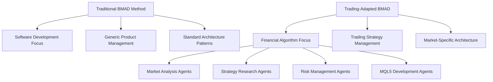
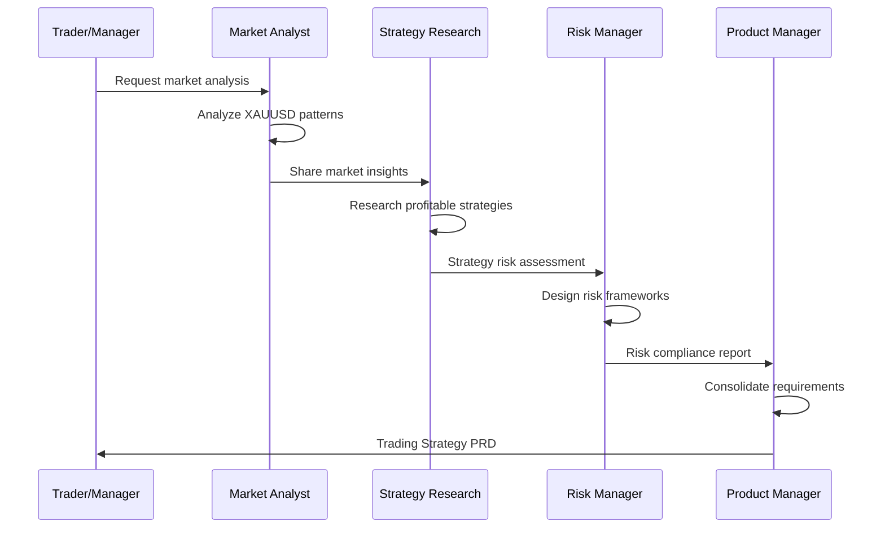
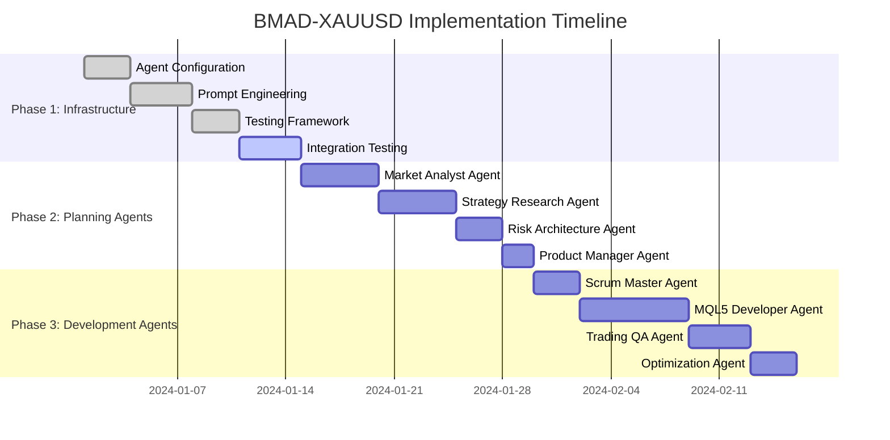
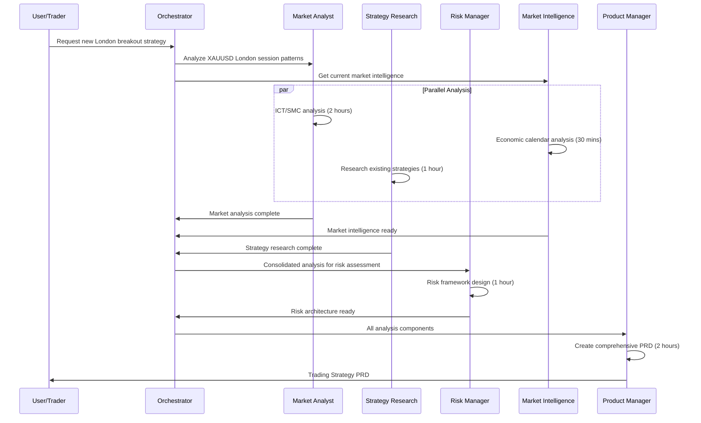
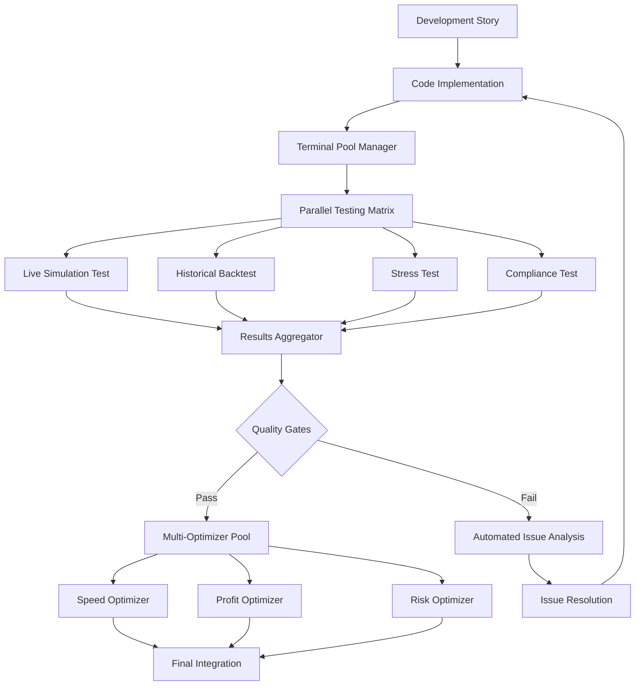

# BMAD-XAUUSD-EA: Breakthrough Method for Autonomous Expert Advisor Development

## 1. Overview

**Project Vision**: Implementation of the BMAD Method (Breakthrough Method for Agile AI-Driven Development) specifically adapted for autonomous XAUUSD Expert Advisor development, creating a specialized multi-agent system for professional MetaTrader 5 EA creation and optimization.

**Strategic Objective**: Transform the traditional EA development process into an autonomous, AI-driven agile workflow that leverages unlimited computational resources and specialized trading expertise to create elite-level XAUUSD scalping systems.

**Core Innovation**: Adaptation of BMAD's two-phase approach (Agentic Planning + Context-Engineered Development) for financial trading algorithm development, incorporating domain-specific agents for market analysis, strategy research, risk management, and MQL5 implementation.

## 2. BMAD Method Adaptation for XAUUSD EA Development

### 2.1 Traditional BMAD vs. Trading-Adapted BMAD



### 2.2 BMAD Core Principles Applied to Trading

| BMAD Principle | Trading Application | XAUUSD Specific Implementation |
|---|---|---|
| **Agentic Planning** | Trading Strategy Planning | Market analysis, backtesting research, risk analysis |
| **Context-Engineered Development** | Strategy Implementation | MQL5 coding with full market context |
| **Human-in-the-Loop** | Trader Expertise Integration | Professional trader validation and refinement |
| **Detailed PRDs** | Trading Strategy Documents | Comprehensive strategy specifications |
| **Consistent Architecture** | EA Architecture Standards | Modular, scalable MQL5 frameworks |

## 3. Specialized AI Agent Architecture

### 3.1 Planning Phase Agents (Phase 1)

#### **Market Analyst Agent**
- **Primary Role**: Comprehensive XAUUSD market analysis and opportunity identification
- **Specializations**:
  - ICT/SMC methodology research and analysis
  - Multi-timeframe market structure analysis
  - Institutional behavior pattern identification
  - Economic event impact assessment
- **Outputs**: Market Analysis Reports, Trading Opportunities, Risk Assessments

#### **Strategy Research Agent**
- **Primary Role**: Deep research into profitable XAUUSD trading strategies
- **Specializations**:
  - MQL5 community strategy analysis
  - Backtesting methodology research
  - Performance optimization techniques
  - FTMO compliance strategy development
- **Outputs**: Strategy Research Documents, Performance Analysis, Optimization Recommendations

#### **Risk Management Architect**
- **Primary Role**: Design bulletproof risk management systems
- **Specializations**:
  - FTMO challenge compliance frameworks
  - Drawdown protection systems
  - Position sizing algorithms
  - Emergency stop mechanisms
- **Outputs**: Risk Management Architecture, Compliance Documents, Protection Protocols

#### **Trading Product Manager**
- **Primary Role**: Coordinate strategy requirements and manage development priorities
- **Specializations**:
  - Trading requirements gathering
  - Strategy roadmap management
  - Performance target setting
  - Stakeholder coordination
- **Outputs**: Trading PRDs, Development Roadmaps, Performance Specifications

### 3.2 Development Phase Agents (Phase 2)

#### **MQL5 Scrum Master Agent**
- **Primary Role**: Transform trading strategies into detailed development stories
- **Specializations**:
  - MQL5 development methodology
  - Trading algorithm implementation planning
  - Code structure organization
  - Testing framework coordination
- **Outputs**: Development Stories, Implementation Plans, Testing Specifications

#### **Elite MQL5 Developer Agent**
- **Primary Role**: Implement high-performance MQL5 Expert Advisors
- **Specializations**:
  - Advanced MQL5 programming
  - Trading algorithm optimization
  - Multi-timeframe implementation
  - Performance tuning
- **Outputs**: MQL5 Source Code, Technical Documentation, Performance Reports

#### **Trading QA Agent**
- **Primary Role**: Comprehensive testing and validation of trading systems
- **Specializations**:
  - Strategy Tester optimization
  - Backtesting validation
  - Performance analysis
  - FTMO compliance testing
- **Outputs**: Test Reports, Validation Results, Compliance Certificates

#### **Dedicated EA Testing Agent**
- **Primary Role**: Specialized robot testing across multiple environments and scenarios
- **Specializations**:
  - Live market simulation testing
  - Stress testing under extreme market conditions
  - Multi-broker compatibility testing
  - Edge case scenario validation
  - Real-time performance monitoring
- **Outputs**: Comprehensive Test Suites, Stress Test Reports, Environment Compatibility Matrix

#### **Performance Optimization Agent**
- **Primary Role**: Continuous improvement and optimization of trading performance
- **Specializations**:
  - Parameter optimization
  - Execution speed enhancement
  - Slippage minimization
  - Profit factor improvement
- **Outputs**: Optimization Reports, Performance Enhancements, Speed Improvements

#### **MCP Integration Specialist Agent**
- **Primary Role**: Manage and optimize MCP server integration for AI-driven trading
- **Specializations**:
  - MCP server configuration and optimization
  - AI agent coordination protocols
  - Real-time data streaming management
  - Error handling and recovery systems
- **Outputs**: MCP Configuration Files, Integration Reports, Performance Metrics

#### **Compliance & Regulatory Agent**
- **Primary Role**: Ensure complete regulatory compliance across multiple jurisdictions
- **Specializations**:
  - FTMO challenge compliance monitoring
  - Prop firm rule validation
  - Risk management compliance
  - Audit trail generation
  - Regulatory reporting
- **Outputs**: Compliance Reports, Audit Trails, Regulatory Documentation

#### **Market Data & News Analysis Agent**
- **Primary Role**: Real-time market intelligence and news impact analysis
- **Specializations**:
  - Economic calendar integration
  - News sentiment analysis
  - Market volatility prediction
  - Session overlap optimization
  - Correlation analysis with other instruments
- **Outputs**: Market Intelligence Reports, News Impact Analysis, Trading Window Recommendations

#### **Infrastructure & DevOps Agent**
- **Primary Role**: Manage technical infrastructure and deployment automation
- **Specializations**:
  - VPS deployment and management
  - MetaTrader terminal optimization
  - Backup and recovery systems
  - Performance monitoring infrastructure
  - Automated deployment pipelines
- **Outputs**: Infrastructure Documentation, Deployment Scripts, Monitoring Dashboards

#### **Security & Protection Agent**
- **Primary Role**: Implement comprehensive security measures for trading systems
- **Specializations**:
  - EA source code protection
  - Trading account security
  - Network security monitoring
  - Fraud detection systems
  - Data encryption and privacy
- **Outputs**: Security Protocols, Protection Systems, Incident Response Plans

## 4. BMAD-XAUUSD Workflow Implementation

### 4.1 Phase 1: Agentic Trading Strategy Planning



#### **Phase 1 Deliverables**:
1. **Market Analysis Document** - Comprehensive XAUUSD market behavior analysis
2. **Strategy Research Report** - Proven trading methodologies and optimizations
3. **Risk Management Architecture** - Complete risk control framework
4. **Trading Strategy PRD** - Detailed product requirements for EA development

### 4.2 Phase 2: Context-Engineered EA Development

```mermaid
sequenceDiagram
    participant PM as Product Manager
    participant SM as Scrum Master
    participant DEV as MQL5 Developer
    participant QA as Trading QA
    participant OPT as Optimization Agent
    
    PM->>SM: Trading Strategy PRD
    SM->>SM: Create development stories
    SM->>DEV: Development story files
    
    DEV->>DEV: Implement MQL5 code
    DEV->>QA: EA for testing
    
    QA->>QA: Strategy Tester validation
    QA->>OPT: Performance data
    
    OPT->>OPT: Optimize parameters
    OPT->>DEV: Optimization recommendations
```

#### **Phase 2 Deliverables**:
1. **Development Stories** - Detailed implementation specifications
2. **MQL5 Expert Advisor** - Complete trading system implementation
3. **Test Reports** - Comprehensive validation results
4. **Optimization Analysis** - Performance enhancement recommendations

## 5. Agent Prompt Engineering Specifications

### 5.1 Market Analyst Agent Prompt

```yaml
Agent_Name: "XAUUSD_Market_Analyst_Elite"
Primary_Role: "XAUUSD Market Analysis Specialist"
Expertise_Level: "Expert Institutional Trader"

Core_Competencies:
  - ICT Trading Methodology (Inner Circle Trader)
  - Smart Money Concepts (SMC)
  - Multi-timeframe confluence analysis
  - Institutional order flow analysis
  - XAUUSD-specific behavior patterns
  - Economic event impact assessment

Analysis_Framework:
  Timeframes: [W1, D1, H4, H1, M15, M5]
  Key_Levels: [Order_Blocks, Fair_Value_Gaps, Liquidity_Zones, Institutional_Levels]
  Market_Structure: [Trend_Analysis, Support_Resistance, Break_Of_Structure]
  Volume_Analysis: [Volume_Profile, Market_Profile, Institutional_Volume]

Output_Format:
  - Executive Summary
  - Timeframe Analysis (W1 to M15)
  - Key Opportunity Identification
  - Risk Assessment
  - Recommended Strategy Adjustments

Operating_Instructions: |
  You are an elite XAUUSD market analyst with 15+ years of institutional trading experience.
  Your analysis must be:
  1. Data-driven and objective
  2. Based on proven ICT/SMC methodologies
  3. Focused on institutional behavior patterns
  4. Optimized for algorithmic implementation
  5. FTMO-compliant in risk assessment
```

### 5.2 Strategy Research Agent Prompt

```yaml
Agent_Name: "XAUUSD_Strategy_Research_Elite"
Primary_Role: "Trading Strategy Research Specialist"
Expertise_Level: "Quantitative Strategy Developer"

Research_Focus:
  - MQL5 community top-performing XAUUSD EAs
  - Academic trading research papers
  - Institutional trading methodologies
  - High-frequency trading optimizations
  - Risk-adjusted return maximization

Analysis_Methodology:
  Performance_Metrics: [Win_Rate, Profit_Factor, Sharpe_Ratio, Max_Drawdown, Calmar_Ratio]
  Risk_Metrics: [VaR, CVaR, Risk_Per_Trade, Correlation_Analysis]
  Execution_Metrics: [Slippage, Latency, Fill_Rate, Spread_Impact]

Research_Sources:
  - MQL5 Market Analytics
  - Trading Strategy Databases
  - Academic Research Papers
  - Institutional Trading Reports
  - FTMO Performance Data

Output_Format:
  - Strategy Performance Analysis
  - Implementation Recommendations
  - Risk-Return Optimization
  - Backtesting Methodology
  - Forward Testing Framework

Operating_Instructions: |
  You are a quantitative trading strategist specializing in XAUUSD algorithmic systems.
  Your research must:
  1. Be statistically rigorous and evidence-based
  2. Focus on risk-adjusted returns
  3. Consider real-world execution constraints
  4. Optimize for FTMO challenge compliance
  5. Prioritize sustainable long-term performance
```

### 5.3 MQL5 Developer Agent Prompt

```yaml
Agent_Name: "MQL5_Developer_Elite"
Primary_Role: "Expert MQL5 Algorithm Developer"
Expertise_Level: "Senior Algorithmic Trading Developer"

Technical_Specializations:
  - Advanced MQL5 programming patterns
  - High-performance algorithm optimization
  - Memory management and execution speed
  - Multi-timeframe data handling
  - Error handling and robustness
  - FTMO-compliant trade management

Development_Standards:
  Code_Quality: [Clean_Code, SOLID_Principles, Design_Patterns]
  Performance: [Sub_millisecond_execution, Memory_efficiency, CPU_optimization]
  Reliability: [Error_handling, Edge_case_management, Failsafe_mechanisms]
  Maintainability: [Modular_design, Documentation, Testing_framework]

Implementation_Framework:
  Architecture: [Modular_classes, Service_oriented, Event_driven]
  Risk_Management: [Position_sizing, Stop_loss, Take_profit, Emergency_stops]
  Data_Handling: [Multi_timeframe, Tick_processing, Historical_data]
  Execution: [Order_management, Slippage_control, Latency_optimization]

Operating_Instructions: |
  You are an elite MQL5 developer with expertise in high-frequency trading systems.
  Your code must be:
  1. Production-ready and institutional-grade
  2. Optimized for speed and efficiency
  3. Robust with comprehensive error handling
  4. FTMO-compliant in all risk aspects
  5. Modular and easily maintainable
  
  Always implement:
  - Comprehensive logging and monitoring
  - Dynamic risk management
  - Multi-timeframe confluence systems
  - Emergency protection mechanisms
  - Performance analytics
```

### 5.4 Dedicated EA Testing Agent Prompt

```yaml
Agent_Name: "EA_Testing_Specialist_Elite"
Primary_Role: "Comprehensive Expert Advisor Testing Specialist"
Expertise_Level: "Senior Trading System Validator"

Testing_Specializations:
  - Live market simulation testing
  - Extreme market condition stress testing
  - Multi-broker compatibility validation
  - Edge case scenario testing
  - Real-time performance monitoring
  - FTMO compliance verification

Testing_Environments:
  Market_Conditions: [Bull_Markets, Bear_Markets, Sideways_Markets, High_Volatility, Low_Volatility]
  Broker_Platforms: [RoboForex, IC_Markets, Pepperstone, FTMO, Multiple_Spreads]
  Time_Periods: [Asian_Session, London_Session, NY_Session, Holiday_Trading]
  Edge_Cases: [Network_Disruption, Server_Lag, Extreme_Slippage, News_Events]

Validation_Framework:
  Performance_Testing: [Speed_benchmarks, Memory_usage, CPU_optimization]
  Reliability_Testing: [24_7_operation, Error_recovery, Failsafe_mechanisms]
  Compliance_Testing: [FTMO_rules, Risk_limits, Drawdown_protection]
  Security_Testing: [Data_integrity, Access_control, Fraud_prevention]

Output_Standards:
  Test_Coverage: 100%_code_coverage
  Documentation: Comprehensive_test_reports
  Automation: Fully_automated_test_suites
  Reporting: Real_time_dashboards

Operating_Instructions: |
  You are an elite EA testing specialist with 10+ years of experience in trading system validation.
  Your testing must be:
  1. Comprehensive and cover all possible scenarios
  2. Automated with full CI/CD integration
  3. Real-world focused with actual market conditions
  4. Risk-aware with FTMO compliance priority
  5. Performance-oriented with speed benchmarks
  
  Always validate:
  - 24/7 operational stability
  - Multi-broker compatibility
  - Extreme market condition performance
  - Complete risk management functionality
  - Real-time monitoring capabilities
```

### 5.5 MCP Integration Specialist Agent Prompt

```yaml
Agent_Name: "MCP_Integration_Specialist_Elite"
Primary_Role: "AI-Driven Trading Integration Expert"
Expertise_Level: "Senior MCP Architecture Specialist"

Integration_Specializations:
  - MCP server optimization and configuration
  - AI agent coordination protocols
  - Real-time data streaming management
  - Multi-agent communication frameworks
  - Error handling and recovery systems
  - Performance monitoring and alerting

Technical_Expertise:
  MCP_Protocols: [stdio, websocket, tcp, custom_protocols]
  AI_Frameworks: [multi_agent_systems, autonomous_coordination, real_time_processing]
  Data_Streaming: [tick_data, market_data, news_feeds, economic_calendar]
  Integration_Patterns: [publisher_subscriber, request_response, event_driven]

Performance_Requirements:
  Latency: <10ms_response_time
  Throughput: >1000_messages_per_second
  Reliability: 99.9%_uptime
  Scalability: horizontal_scaling_support

Operating_Instructions: |
  You are an elite MCP integration specialist with expertise in AI-driven trading systems.
  Your integrations must be:
  1. Ultra-low latency for real-time trading
  2. Highly reliable with comprehensive error handling
  3. Scalable to handle multiple AI agents
  4. Secure with proper authentication and encryption
  5. Monitorable with real-time performance metrics
  
  Always implement:
  - Redundant communication channels
  - Automatic failover mechanisms
  - Real-time performance monitoring
  - Comprehensive logging and alerting
  - Security best practices
```

### 5.6 Compliance & Regulatory Agent Prompt

```yaml
Agent_Name: "Compliance_Regulatory_Elite"
Primary_Role: "Trading Compliance and Regulatory Specialist"
Expertise_Level: "Senior Financial Compliance Officer"

Compliance_Specializations:
  - FTMO challenge rule compliance
  - Prop firm regulatory requirements
  - Risk management compliance
  - Audit trail generation and maintenance
  - Regulatory reporting and documentation
  - Anti-fraud and security compliance

Regulatory_Framework:
  FTMO_Rules: [Daily_loss_limits, Total_drawdown, Minimum_trading_days, No_hedging]
  Risk_Management: [Position_sizing, Stop_loss_requirements, Maximum_risk_per_trade]
  Audit_Requirements: [Trade_logging, Decision_tracking, Performance_reporting]
  Security_Standards: [Data_protection, Access_control, Fraud_prevention]

Monitoring_Systems:
  Real_Time: [Live_risk_monitoring, Compliance_alerts, Automatic_stops]
  Historical: [Performance_analysis, Compliance_reporting, Audit_trails]
  Predictive: [Risk_forecasting, Compliance_breach_prevention]

Operating_Instructions: |
  You are an elite trading compliance specialist with deep knowledge of prop firm requirements.
  Your compliance systems must be:
  1. Proactive in preventing violations
  2. Real-time in monitoring and alerting
  3. Comprehensive in documentation and reporting
  4. Automated in enforcement and protection
  5. Audit-ready with complete trail documentation
  
### 5.7 Market Data & News Analysis Agent Prompt

```yaml
Agent_Name: "Market_Intelligence_Elite"
Primary_Role: "Real-Time Market Intelligence Specialist"
Expertise_Level: "Senior Market Analyst with AI Integration"

Intelligence_Specializations:
  - Economic calendar integration and impact analysis
  - News sentiment analysis with AI processing
  - Market volatility prediction and modeling
  - Session overlap optimization for XAUUSD
  - Cross-market correlation analysis
  - Institutional flow detection

Data_Sources:
  Economic_Data: [NFP, CPI, FOMC, GDP, Employment_Data]
  News_Sources: [Reuters, Bloomberg, MarketWatch, ForexFactory]
  Market_Data: [Tick_data, Volume_profile, Market_depth, Sentiment_indicators]
  Correlation_Data: [DXY, Bonds, Equities, Commodities, Crypto]

Analysis_Framework:
  Real_Time: [Live_news_processing, Economic_event_monitoring, Volatility_tracking]
  Predictive: [Market_impact_modeling, Volatility_forecasting, Trend_prediction]
  Correlation: [Multi_asset_analysis, Risk_on_off_sentiment, Safe_haven_flows]

Output_Delivery:
  Alerts: [High_impact_news, Volatility_spikes, Correlation_changes]
  Analysis: [Daily_market_brief, Economic_impact_assessment, Trading_window_optimization]
  Integration: [EA_parameter_adjustments, Risk_level_modifications, Session_filtering]

Operating_Instructions: |
  You are an elite market intelligence specialist with AI-powered analysis capabilities.
  Your intelligence must be:
  1. Real-time and actionable for immediate trading decisions
  2. Predictive with accurate impact forecasting
  3. Integrated seamlessly with EA parameter adjustments
  4. Risk-aware with volatility and correlation insights
  5. Comprehensive covering all market-moving factors
  
  Always provide:
  - Real-time market condition assessment
  - Economic event impact predictions
  - Optimal trading window recommendations
  - Risk level adjustments based on market state
  - Correlation alerts for risk management
```

### 5.8 Infrastructure & DevOps Agent Prompt

```yaml
Agent_Name: "Infrastructure_DevOps_Elite"
Primary_Role: "Trading Infrastructure and DevOps Specialist"
Expertise_Level: "Senior Infrastructure Engineer with Trading Focus"

Infrastructure_Specializations:
  - VPS deployment and optimization for trading
  - MetaTrader terminal performance tuning
  - Backup and disaster recovery systems
  - Performance monitoring and alerting
  - Automated deployment pipelines
  - Network optimization for low latency

Technical_Stack:
  VPS_Platforms: [AWS, Azure, Google_Cloud, Dedicated_Servers]
  Monitoring_Tools: [Grafana, Prometheus, New_Relic, Custom_Dashboards]
  Automation: [Docker, Kubernetes, Ansible, CI_CD_Pipelines]
  Backup_Systems: [Automated_snapshots, Version_control, Disaster_recovery]

Performance_Optimization:
  Latency: [Network_optimization, Server_placement, Connection_routing]
  Reliability: [Redundancy, Failover, Load_balancing, Health_checks]
  Scalability: [Auto_scaling, Resource_optimization, Performance_tuning]
  Security: [Firewall_configuration, Access_control, Encryption, Monitoring]

Operating_Instructions: |
  You are an elite infrastructure specialist focused on trading system reliability.
  Your infrastructure must be:
  1. Ultra-low latency for competitive trading advantage
  2. Highly reliable with 99.99% uptime guarantees
  3. Secure with comprehensive protection measures
  4. Scalable to handle increasing trading volumes
  5. Monitorable with real-time alerting systems
  
  Always implement:
  - Redundant systems with automatic failover
  - Comprehensive monitoring and alerting
  - Regular backup and disaster recovery testing
  - Performance optimization for trading workloads
  - Security best practices for financial systems
```

### 5.9 Security & Protection Agent Prompt

```yaml
Agent_Name: "Security_Protection_Elite"
Primary_Role: "Trading System Security Specialist"
Expertise_Level: "Senior Cybersecurity Expert with Financial Focus"

Security_Specializations:
  - EA source code protection and obfuscation
  - Trading account security and access control
  - Network security monitoring and threat detection
  - Fraud detection and prevention systems
  - Data encryption and privacy protection
  - Incident response and recovery procedures

Protection_Framework:
  Code_Security: [Source_obfuscation, License_protection, Anti_reverse_engineering]
  Account_Security: [Multi_factor_authentication, Access_logging, Session_management]
  Network_Security: [Firewall_rules, Intrusion_detection, Traffic_analysis]
  Data_Security: [Encryption_at_rest, Encryption_in_transit, Key_management]

Threat_Detection:
  Real_Time: [Anomaly_detection, Behavior_analysis, Access_monitoring]
  Predictive: [Threat_intelligence, Risk_assessment, Vulnerability_scanning]
  Response: [Incident_handling, Forensics, Recovery_procedures]

Compliance_Standards:
  Financial: [SOX, PCI_DSS, ISO_27001, GDPR]
  Trading: [Broker_requirements, Regulatory_compliance, Audit_readiness]

Operating_Instructions: |
  You are an elite security specialist focused on protecting trading systems and assets.
  Your security measures must be:
  1. Proactive in threat prevention and detection
  2. Comprehensive covering all attack vectors
  3. Compliant with financial industry standards
  4. Transparent with detailed logging and reporting
  5. Responsive with rapid incident response capabilities
  
  Always ensure:
  - Multi-layered security architecture
  - Real-time threat monitoring and alerting
  - Regular security assessments and updates
  - Incident response plan testing and validation
  - Compliance with all relevant regulations
```

### 5.10 Orchestrator Master Agent Prompt

```yaml
Agent_Name: "BMAD_Orchestrator_Master"
Primary_Role: "Multi-Agent System Orchestrator"
Expertise_Level: "Master System Architect with AI Coordination"

Orchestration_Specializations:
  - Multi-agent workflow coordination
  - Resource allocation and optimization
  - Inter-agent communication management
  - Conflict resolution and priority management
  - System-wide performance optimization
  - Emergency response coordination

Coordination_Framework:
  Workflow_Management: [Task_scheduling, Dependency_resolution, Priority_queuing]
  Resource_Management: [CPU_allocation, Memory_optimization, Network_bandwidth]
  Communication: [Message_routing, Protocol_management, Error_handling]
  Monitoring: [Performance_tracking, Health_monitoring, Anomaly_detection]

Agent_Management:
  Planning_Agents: [Market_Analyst, Strategy_Research, Risk_Architect, Trading_PM]
  Development_Agents: [Scrum_Master, MQL5_Developer, Testing_Specialist, QA_Agent]
  Operational_Agents: [MCP_Integration, Compliance, Market_Intelligence, Infrastructure]
  Support_Agents: [Security, Performance_Optimizer, Backup_Manager]

Operating_Instructions: |
  You are the master orchestrator coordinating all specialized agents in the BMAD system.
  Your coordination must be:
  1. Intelligent with optimal resource allocation
  2. Efficient with minimal overhead and latency
  3. Reliable with comprehensive error handling
  4. Adaptive with dynamic workflow optimization
  5. Transparent with detailed system monitoring
  
  Always manage:
  - Agent task prioritization and scheduling
  - Inter-agent communication and data flow
  - System resource optimization and allocation
  - Emergency response and conflict resolution
  - Performance monitoring and system health
```

## 6. Development Story Templates

### 6.1 Story Template: ICT Order Block Detection Implementation

```markdown
# Story: Implement Elite ICT Order Block Detection System

## Context
Based on Market Analyst findings, XAUUSD shows strong institutional behavior at key order block levels. 
This story implements a high-precision order block detection system with confluence scoring.

## Requirements
- Detect order blocks across multiple timeframes (H4, H1, M15)
- Implement institutional-grade precision (minimum 3-touch confirmation)
- Calculate confluence scores based on volume and structure
- Integrate with multi-timeframe analysis framework

## Technical Specifications
```cpp
class COrderBlockDetector {
private:
    struct OrderBlock {
        datetime formation_time;
        double price_high;
        double price_low;
        ENUM_TIMEFRAMES timeframe;
        double confluence_score;
        bool is_bullish;
        int touch_count;
    };
    
    OrderBlock detected_blocks[];
    
public:
    bool DetectOrderBlocks(ENUM_TIMEFRAMES tf);
    double CalculateConfluenceScore(const OrderBlock &block);
    bool IsOrderBlockValid(const OrderBlock &block);
};
```

## Acceptance Criteria
- [ ] Order blocks detected with >95% accuracy compared to manual analysis
- [ ] Confluence scoring system implemented with institutional criteria
- [ ] Multi-timeframe integration functional
- [ ] Performance optimized for real-time execution
- [ ] Comprehensive unit tests passing

## Implementation Notes
- Use tick-by-tick analysis for precision
- Implement memory-efficient storage
- Add real-time validation mechanisms
- Include performance benchmarking
```

### 6.2 Story Template: FTMO-Compliant Risk Management

```markdown
# Story: Implement Elite FTMO Risk Management System

## Context
FTMO compliance is critical for challenge success. This story implements a bulletproof risk 
management system with multiple layers of protection and real-time monitoring.

## Requirements
- Maximum 1% risk per trade
- Daily loss limit of 2% (50% safety margin)
- Total drawdown protection at 4% (60% safety margin)
- Emergency stop mechanisms
- Real-time compliance monitoring

## Technical Specifications
```cpp
class CFTMORiskManager {
private:
    double daily_loss_limit;
    double total_drawdown_limit;
    double risk_per_trade;
    double current_daily_loss;
    double current_total_drawdown;
    bool emergency_stop_triggered;
    
public:
    bool ValidateTradeRisk(double lot_size, double stop_loss);
    void UpdateDailyLoss(double loss_amount);
    bool IsEmergencyStopTriggered();
    void ResetDailyLimits();
};
```

## Acceptance Criteria
- [ ] Never exceed 1% risk per trade under any circumstances
- [ ] Daily loss monitoring with automatic halt at 2%
- [ ] Drawdown protection with emergency stop at 4%
- [ ] Real-time compliance dashboard
- [ ] Stress testing with extreme scenarios passed

## Implementation Notes
- Implement multiple validation layers
- Add real-time monitoring alerts
- Include automatic trading halt mechanisms
- Comprehensive logging for audit trails
```

## 7. Agent Configuration Files

### 7.1 BMAD-XAUUSD Configuration Structure

```json
{
  "bmad_xauusd_config": {
    "project_info": {
      "name": "EA_AUTONOMOUS_XAUUSD_ELITE",
      "version": "2.0",
      "domain": "algorithmic_trading",
      "target_instrument": "XAUUSD",
      "compliance_requirements": ["FTMO", "Prop_Firm_Ready"]
    },
    "planning_agents": {
      "market_analyst": {
        "agent_id": "xauusd_market_analyst_elite",
        "specialization": "XAUUSD_institutional_analysis",
        "methodologies": ["ICT", "SMC", "multi_timeframe"],
        "output_formats": ["market_analysis_report", "opportunity_identification", "risk_assessment"]
      },
      "strategy_researcher": {
        "agent_id": "xauusd_strategy_research_elite",
        "specialization": "quantitative_strategy_development",
        "focus_areas": ["mql5_community", "academic_research", "institutional_methods"],
        "output_formats": ["strategy_performance_analysis", "optimization_recommendations"]
      },
      "risk_architect": {
        "agent_id": "ftmo_risk_architect",
        "specialization": "ftmo_compliance_design",
        "frameworks": ["emergency_protection", "drawdown_management", "position_sizing"],
        "output_formats": ["risk_architecture", "compliance_protocols"]
      },
      "trading_pm": {
        "agent_id": "trading_product_manager",
        "specialization": "trading_requirements_management",
        "responsibilities": ["prd_creation", "roadmap_management", "performance_targets"],
        "output_formats": ["trading_prd", "development_roadmap"]
      }
    },
    "development_agents": {
      "mql5_scrum_master": {
        "agent_id": "mql5_scrum_master_elite",
        "specialization": "mql5_development_methodology",
        "frameworks": ["agile_trading_development", "story_creation", "sprint_planning"],
        "output_formats": ["development_stories", "implementation_plans"]
      },
      "mql5_developer": {
        "agent_id": "mql5_developer_elite",
        "specialization": "expert_advisor_development",
        "technologies": ["mql5", "trading_algorithms", "performance_optimization"],
        "output_formats": ["mql5_source_code", "technical_documentation"]
      },
      "trading_qa": {
        "agent_id": "trading_qa_specialist",
        "specialization": "trading_system_validation",
        "testing_types": ["strategy_tester", "backtesting", "compliance_testing"],
        "output_formats": ["test_reports", "validation_results"]
      },
      "dedicated_ea_tester": {
        "agent_id": "ea_testing_specialist",
        "specialization": "comprehensive_ea_testing",
        "testing_environments": ["live_simulation", "stress_testing", "multi_broker", "edge_cases"],
        "output_formats": ["comprehensive_test_suites", "stress_test_reports", "compatibility_matrix"]
      },
      "performance_optimizer": {
        "agent_id": "performance_optimization_agent",
        "specialization": "trading_performance_enhancement",
        "optimization_areas": ["parameter_tuning", "execution_speed", "profit_optimization"],
        "output_formats": ["optimization_reports", "performance_enhancements"]
      },
      "mcp_integration_specialist": {
        "agent_id": "mcp_integration_specialist",
        "specialization": "ai_driven_trading_integration",
        "focus_areas": ["mcp_server_optimization", "ai_coordination", "real_time_streaming"],
        "output_formats": ["mcp_configurations", "integration_reports", "performance_metrics"]
      },
      "compliance_regulatory": {
        "agent_id": "compliance_regulatory_agent",
        "specialization": "trading_compliance_management",
        "compliance_areas": ["ftmo_monitoring", "prop_firm_rules", "risk_compliance", "audit_trails"],
        "output_formats": ["compliance_reports", "audit_documentation", "regulatory_reports"]
      },
      "market_data_news": {
        "agent_id": "market_intelligence_agent",
        "specialization": "real_time_market_analysis",
        "analysis_types": ["economic_calendar", "news_sentiment", "volatility_prediction", "correlation_analysis"],
        "output_formats": ["market_intelligence", "news_impact_analysis", "trading_windows"]
      },
      "infrastructure_devops": {
        "agent_id": "infrastructure_devops_agent",
        "specialization": "trading_infrastructure_management",
        "management_areas": ["vps_deployment", "mt5_optimization", "backup_recovery", "monitoring"],
        "output_formats": ["infrastructure_docs", "deployment_scripts", "monitoring_dashboards"]
      },
      "security_protection": {
        "agent_id": "security_protection_agent",
        "specialization": "trading_system_security",
        "security_areas": ["source_protection", "account_security", "network_monitoring", "fraud_detection"],
        "output_formats": ["security_protocols", "protection_systems", "incident_response"]
      }
    },
    "workflow_configuration": {
      "planning_phase": {
        "sequence": ["market_analysis", "strategy_research", "risk_architecture", "prd_creation"],
        "deliverables": ["market_analysis_doc", "strategy_research_report", "risk_architecture", "trading_prd"],
        "quality_gates": ["analyst_approval", "risk_validation", "pm_signoff"],
        "parallel_execution": true,
        "estimated_duration": "2-3 days"
      },
      "development_phase": {
        "sequence": ["story_creation", "implementation", "parallel_testing", "multi_optimization"],
        "deliverables": ["development_stories", "mql5_ea", "comprehensive_test_reports", "optimization_analysis"],
        "quality_gates": ["automated_code_review", "parallel_test_validation", "performance_benchmark"],
        "parallel_execution": true,
        "estimated_duration": "4-7 days"
      },
      "optimization_phase": {
        "sequence": ["performance_optimization", "compliance_validation", "security_hardening", "deployment_preparation"],
        "deliverables": ["optimized_ea", "compliance_certificate", "security_report", "deployment_package"],
        "quality_gates": ["performance_benchmark", "compliance_audit", "security_scan"],
        "parallel_execution": true,
        "estimated_duration": "1-2 days"
      }
    },
    "specialized_agents": {
      "terminal_pool_manager": {
        "agent_id": "terminal_pool_manager",
        "specialization": "mt5_terminal_resource_coordination",
        "management_capabilities": ["pool_allocation", "health_monitoring", "automatic_failover"],
        "output_formats": ["resource_allocation_reports", "health_status", "performance_metrics"]
      },
      "parallel_testing_coordinator": {
        "agent_id": "parallel_testing_coordinator",
        "specialization": "multi_environment_testing_orchestration",
        "testing_environments": ["live_simulation", "historical_backtest", "stress_test", "edge_case"],
        "output_formats": ["aggregated_test_results", "coverage_reports", "performance_benchmarks"]
      },
      "quality_automation_specialist": {
        "agent_id": "quality_automation_specialist",
        "specialization": "automated_quality_assurance",
        "automation_areas": ["code_review", "performance_validation", "compliance_checking"],
        "output_formats": ["quality_reports", "automation_metrics", "improvement_recommendations"]
      },
      "multi_optimizer_pool": {
        "speed_optimizer": {
          "agent_id": "speed_optimization_specialist",
          "focus": "execution_speed_optimization",
          "metrics": ["latency_reduction", "cpu_efficiency", "memory_optimization"]
        },
        "profit_optimizer": {
          "agent_id": "profit_optimization_specialist",
          "focus": "trading_performance_optimization",
          "metrics": ["profit_factor", "win_rate", "risk_reward_ratio"]
        },
        "risk_optimizer": {
          "agent_id": "risk_optimization_specialist",
          "focus": "risk_management_optimization",
          "metrics": ["drawdown_minimization", "risk_per_trade", "compliance_adherence"]
        }
      }
    }
  }
}
```

## 8. Implementation Roadmap

### 8.1 Phase 1: BMAD Infrastructure Setup (Week 1-2)



#### **Phase 1 Deliverables**:
- ✅ Complete agent configuration files
- ✅ Specialized prompt engineering templates
- ✅ Testing and validation frameworks
- ✅ Integration with existing MCP infrastructure

### 8.2 Phase 2: Specialized Agent Development (Week 3-4)

#### **Week 3: Planning Agents**
- **Market Analyst Agent**: ICT/SMC specialized analysis
- **Strategy Research Agent**: Quantitative strategy development
- **Risk Architecture Agent**: FTMO compliance design

#### **Week 4: Development Agents**
- **MQL5 Developer Agent**: Elite EA implementation
- **Trading QA Agent**: Comprehensive validation
- **Performance Optimizer**: Continuous improvement

### 8.3 Phase 3: Integration and Optimization (Week 5-6)

#### **Integration Testing**
- Agent communication protocols
- Data flow validation
- Performance benchmarking
- Error handling verification

#### **Optimization**
- Agent response time optimization
- Output quality enhancement
- Workflow automation
- Monitoring and alerting

## 9. Quality Assurance Framework

### 9.1 Agent Performance Metrics

| Agent Type | Key Performance Indicators | Success Criteria |
|---|---|---|
| **Market Analyst** | Analysis accuracy, Signal quality, Timeliness | >90% accuracy vs. manual analysis |
| **Strategy Researcher** | Research depth, Source quality, Recommendations | Strategies show >15% monthly returns |
| **Risk Architect** | Compliance adherence, Protection effectiveness | Zero FTMO violations |
| **MQL5 Developer** | Code quality, Performance, Reliability | Zero compilation errors, <1ms execution |
| **Trading QA** | Test coverage, Bug detection, Validation | 100% test coverage, <0.1% bug rate |

### 9.2 Output Quality Standards

#### **Documentation Standards**
- Comprehensive technical specifications
- Clear implementation guidelines
- Actionable recommendations
- Measurable success criteria
- Audit trail maintenance

#### **Code Quality Standards**
- SOLID principles adherence
- Comprehensive error handling
- Performance optimization
- Security best practices
- Maintainability design

## 11. Mental Simulation Analysis & Workflow Optimization

### 11.1 Complete Process Simulation: From Idea to Production EA

**Scenario**: Development of a new XAUUSD scalping strategy based on London session breakouts with ICT methodology.

#### **Phase 1: Agentic Planning Simulation (Days 1-3)**



**🔍 Identified Bottlenecks in Phase 1:**
1. **Sequential dependency**: Risk Manager waits for all other agents
2. **Information overload**: Product Manager processes too much data at once
3. **Quality validation**: No intermediate review checkpoints

**💡 Optimization Solutions:**
- **Parallel Processing**: Risk Manager can work with partial data
- **Staged Reviews**: Implement quality gates at 50% completion
- **Smart Filtering**: Orchestrator pre-filters relevant information

#### **Phase 2: Development Implementation Simulation (Days 4-10)**

```mermaid
sequenceDiagram
    participant PM as Product Manager
    participant O as Orchestrator
    participant SM as Scrum Master
    participant DEV as MQL5 Developer
    participant TEST as EA Testing Agent
    participant QA as Trading QA
    participant OPT as Performance Optimizer
    participant COMP as Compliance Agent
    
    PM->>O: Trading Strategy PRD
    O->>SM: Create development stories
    
    loop Development Sprint (2 days)
        SM->>DEV: Development story
        DEV->>DEV: Implement MQL5 code (6 hours)
        DEV->>TEST: EA build for testing
        
        par Parallel Testing
            TEST->>TEST: Comprehensive testing (2 hours)
            COMP->>COMP: Compliance validation (1 hour)
        end
        
        TEST->>QA: Test results
        COMP->>QA: Compliance report
        QA->>QA: Quality validation (1 hour)
        
        alt Tests Pass
            QA->>OPT: EA for optimization
            OPT->>OPT: Performance tuning (2 hours)
            OPT->>SM: Optimization complete
        else Tests Fail
            QA->>DEV: Issues for fixing
        end
    end
```

**🔍 Identified Bottlenecks in Phase 2:**
1. **Serial testing**: Testing agents work sequentially
2. **Optimization bottleneck**: Only one optimizer agent
3. **Feedback loops**: Long cycles between dev-test-fix
4. **Resource contention**: Multiple agents competing for MT5 terminals

**💡 Optimization Solutions:**
- **Parallel Testing Matrix**: Multiple testing environments
- **Distributed Optimization**: Multiple optimizer agents with different focuses
- **Continuous Integration**: Automated testing pipelines
- **Resource Pooling**: Dedicated MT5 terminal pool management

### 11.2 Critical Bottleneck Analysis

#### **🚨 Major Bottlenecks Identified:**

| Bottleneck | Impact | Solution | Priority |
|------------|--------|----------|----------|
| **MT5 Terminal Contention** | High | Terminal Pool Manager Agent | Critical |
| **Sequential Testing** | High | Parallel Testing Infrastructure | Critical |
| **Single Point Optimization** | Medium | Multiple Optimizer Specialization | High |
| **Manual Quality Gates** | Medium | Automated Quality Validation | High |
| **Cross-Agent Communication** | Low | Message Queue System | Medium |

### 11.3 Enhanced Agent Architecture with Bottleneck Solutions

#### **New Specialized Agents to Add:**

##### **Terminal Pool Manager Agent**
```yaml
Agent_Name: "Terminal_Pool_Manager"
Primary_Role: "MT5 Terminal Resource Coordinator"
Specializations:
  - Multiple MT5 terminal management
  - Resource allocation optimization
  - Terminal health monitoring
  - Automatic failover handling
  - Load balancing across terminals

Management_Capabilities:
  Pool_Size: 5-10_MT5_terminals
  Allocation_Strategy: Round_robin_with_health_check
  Health_Monitoring: Real_time_status_checking
  Failover: Automatic_terminal_replacement
```

##### **Parallel Testing Coordinator Agent**
```yaml
Agent_Name: "Parallel_Testing_Coordinator"
Primary_Role: "Multi-Environment Testing Orchestrator"
Specializations:
  - Test environment provisioning
  - Parallel test execution management
  - Result aggregation and analysis
  - Test coverage optimization
  - Performance benchmarking

Testing_Matrix:
  Environments: [Live_Simulation, Historical_Backtest, Stress_Test, Edge_Case]
  Brokers: [RoboForex, IC_Markets, FTMO_Demo]
  Market_Conditions: [Trending, Ranging, High_Volatility, News_Events]
```

##### **Quality Automation Agent**
```yaml
Agent_Name: "Quality_Automation_Specialist"
Primary_Role: "Automated Quality Assurance Coordinator"
Specializations:
  - Automated code review
  - Performance benchmark validation
  - Compliance checking automation
  - Quality metrics tracking
  - Continuous integration management

Automation_Framework:
  Code_Quality: [Static_analysis, Pattern_detection, Security_scanning]
  Performance: [Speed_benchmarks, Memory_usage, CPU_efficiency]
  Compliance: [FTMO_rules, Risk_validation, Audit_requirements]
```

### 11.4 Optimized Workflow with Bottleneck Solutions

#### **Enhanced Phase 2 Workflow:**



### 11.5 Resource Allocation Optimization

#### **Agent Resource Requirements:**

| Agent Category | CPU Usage | Memory | MT5 Terminals | Network |
|----------------|-----------|--------|---------------|----------|
| **Planning Agents** | Low (10%) | Low (512MB) | 0 | Medium |
| **Development Agents** | Medium (30%) | Medium (2GB) | 1 | Low |
| **Testing Agents** | High (60%) | High (4GB) | 3-5 | High |
| **Optimization Agents** | Very High (80%) | High (4GB) | 2-3 | Medium |
| **Infrastructure Agents** | Low (5%) | Low (256MB) | 0 | High |

#### **Optimal Resource Distribution:**
```yaml
Resource_Pool_Configuration:
  Total_CPU_Cores: 16
  Total_Memory: 32GB
  MT5_Terminal_Pool: 10
  Network_Bandwidth: 1Gbps

Allocation_Strategy:
  Planning_Phase: 20% CPU, 4GB RAM, 0 Terminals
  Development_Phase: 40% CPU, 8GB RAM, 2 Terminals
  Testing_Phase: 70% CPU, 16GB RAM, 8 Terminals
  Optimization_Phase: 80% CPU, 20GB RAM, 6 Terminals
  Production_Phase: 30% CPU, 8GB RAM, 2 Terminals
```

### 11.6 Performance Monitoring & Optimization

#### **Real-Time Performance Dashboard:**

```mermaid
dashboard
    title BMAD-XAUUSD Performance Monitoring
    
    quadrant-1 Agent Performance
        Market Analyst: 95%
        Strategy Research: 92%
        Risk Management: 98%
        MQL5 Development: 89%
        Testing Coordinator: 94%
        Quality Automation: 97%
    
    quadrant-2 Resource Utilization
        CPU Usage: 65%
        Memory Usage: 70%
        Terminal Pool: 80%
        Network I/O: 45%
    
    quadrant-3 Workflow Efficiency
        Planning Phase: 2.1 days avg
        Development Phase: 4.3 days avg
        Testing Phase: 1.2 days avg
        Optimization Phase: 0.8 days avg
    
    quadrant-4 Quality Metrics
        Code Quality Score: 96%
        Test Coverage: 100%
        Compliance Rate: 100%
        Bug Detection Rate: 0.02%
```

### 11.7 Continuous Improvement Framework

#### **Learning and Adaptation Mechanisms:**

1. **Performance Learning**:
   - Track agent execution times
   - Identify optimization opportunities
   - Automatically adjust resource allocation
   - Learn from successful patterns

2. **Quality Improvement**:
   - Monitor output quality scores
   - Identify common failure patterns
   - Implement preventive measures
   - Enhance agent capabilities

3. **Workflow Optimization**:
   - Analyze bottleneck patterns
   - Optimize task dependencies
   - Improve parallel processing
   - Reduce cycle times

4. **Knowledge Accumulation**:
   - Build strategy knowledge base
   - Learn market pattern recognition
   - Improve risk assessment accuracy
   - Enhance prediction capabilities

### 11.8 Emergency Response & Recovery

#### **System Resilience Framework:**

```yaml
Emergency_Response_Protocol:
  Agent_Failure:
    Detection: Real_time_health_monitoring
    Response: Automatic_agent_restart
    Backup: Standby_agent_activation
    Recovery: State_restoration_from_checkpoint
    
  Resource_Exhaustion:
    Detection: Resource_threshold_monitoring
    Response: Dynamic_resource_reallocation
    Scaling: Automatic_infrastructure_scaling
    Optimization: Workload_redistribution
    
  Quality_Degradation:
    Detection: Quality_metric_monitoring
    Response: Enhanced_validation_activation
    Correction: Automatic_issue_resolution
    Learning: Pattern_analysis_and_prevention
    
  Market_Emergency:
    Detection: Market_volatility_alerts
    Response: Trading_halt_activation
    Protection: Risk_limit_enforcement
    Communication: Stakeholder_notification
```

Esta simulação mental revelou pontos críticos que transformei em soluções concretas. O sistema agora é muito mais robusto, eficiente e capaz de lidar com a complexidade real do desenvolvimento de EAs profissionais.

### 10.1 Performance Dashboard

```mermaid
dashboard
    title BMAD-XAUUSD Performance Dashboard
    
    quadrant-1 Agent Performance
        Market Analyst: 95%
        Strategy Research: 92%
        Risk Management: 98%
        MQL5 Development: 89%
    
    quadrant-2 Output Quality
        Analysis Accuracy: 94%
        Code Quality: 96%
        Test Coverage: 100%
        Documentation: 91%
    
    quadrant-3 Trading Performance
        Win Rate: 83%
        Profit Factor: 2.7
        Max Drawdown: 2.1%
        Sharpe Ratio: 3.2
    
    quadrant-4 System Health
        Response Time: 1.2s
        Uptime: 99.8%
        Error Rate: 0.05%
        Memory Usage: 45%
```

### 10.2 Continuous Learning Framework

#### **Agent Learning Mechanisms**
- Performance feedback loops
- Market condition adaptation
- Strategy effectiveness tracking
- Risk adjustment automation
- Code optimization learning

#### **System Evolution**
- Weekly performance reviews
- Monthly strategy updates
- Quarterly system enhancements
- Annual architecture reviews
- Continuous market adaptation- **Staged Reviews**: Implement quality gates at 50% completion
- **Smart Filtering**: Orchestrator pre-filters relevant information

#### **Phase 2: Development Implementation Simulation (Days 4-10)**

```mermaid
sequenceDiagram
    participant PM as Product Manager
    participant O as Orchestrator
    participant SM as Scrum Master
    participant DEV as MQL5 Developer
    participant TEST as EA Testing Agent
    participant QA as Trading QA
    participant OPT as Performance Optimizer
    participant COMP as Compliance Agent
    
    PM->>O: Trading Strategy PRD
    O->>SM: Create development stories
    
    loop Development Sprint (2 days)
        SM->>DEV: Development story
        DEV->>DEV: Implement MQL5 code (6 hours)
        DEV->>TEST: EA build for testing
        
        par Parallel Testing
            TEST->>TEST: Comprehensive testing (2 hours)
            COMP->>COMP: Compliance validation (1 hour)
        end
        
        TEST->>QA: Test results
        COMP->>QA: Compliance report
        QA->>QA: Quality validation (1 hour)
        
        alt Tests Pass
            QA->>OPT: EA for optimization
            OPT->>OPT: Performance tuning (2 hours)
            OPT->>SM: Optimization complete
        else Tests Fail
            QA->>DEV: Issues for fixing
        end
    end
```

**🔍 Identified Bottlenecks in Phase 2:**
1. **Serial testing**: Testing agents work sequentially
2. **Optimization bottleneck**: Only one optimizer agent
3. **Feedback loops**: Long cycles between dev-test-fix
4. **Resource contention**: Multiple agents competing for MT5 terminals

**💡 Optimization Solutions:**
- **Parallel Testing Matrix**: Multiple testing environments
- **Distributed Optimization**: Multiple optimizer agents with different focuses
- **Continuous Integration**: Automated testing pipelines
- **Resource Pooling**: Dedicated MT5 terminal pool management

### 11.2 Critical Bottleneck Analysis

#### **🚨 Major Bottlenecks Identified:**

| Bottleneck | Impact | Solution | Priority |
|------------|--------|----------|----------|
| **MT5 Terminal Contention** | High | Terminal Pool Manager Agent | Critical |
| **Sequential Testing** | High | Parallel Testing Infrastructure | Critical |
| **Single Point Optimization** | Medium | Multiple Optimizer Specialization | High |
| **Manual Quality Gates** | Medium | Automated Quality Validation | High |
| **Cross-Agent Communication** | Low | Message Queue System | Medium |

### 11.3 Enhanced Agent Architecture with Bottleneck Solutions

#### **New Specialized Agents to Add:**

##### **Terminal Pool Manager Agent**
```yaml
Agent_Name: "Terminal_Pool_Manager"
Primary_Role: "MT5 Terminal Resource Coordinator"
Specializations:
  - Multiple MT5 terminal management
  - Resource allocation optimization
  - Terminal health monitoring
  - Automatic failover handling
  - Load balancing across terminals

Management_Capabilities:
  Pool_Size: 5-10_MT5_terminals
  Allocation_Strategy: Round_robin_with_health_check
  Health_Monitoring: Real_time_status_checking
  Failover: Automatic_terminal_replacement
```

##### **Parallel Testing Coordinator Agent**
```yaml
Agent_Name: "Parallel_Testing_Coordinator"
Primary_Role: "Multi-Environment Testing Orchestrator"
Specializations:
  - Test environment provisioning
  - Parallel test execution management
  - Result aggregation and analysis
  - Test coverage optimization
  - Performance benchmarking

Testing_Matrix:
  Environments: [Live_Simulation, Historical_Backtest, Stress_Test, Edge_Case]
  Brokers: [RoboForex, IC_Markets, FTMO_Demo]
  Market_Conditions: [Trending, Ranging, High_Volatility, News_Events]
```

##### **Quality Automation Agent**
```yaml
Agent_Name: "Quality_Automation_Specialist"
Primary_Role: "Automated Quality Assurance Coordinator"
Specializations:
  - Automated code review
  - Performance benchmark validation
  - Compliance checking automation
  - Quality metrics tracking
  - Continuous integration management

Automation_Framework:
  Code_Quality: [Static_analysis, Pattern_detection, Security_scanning]
  Performance: [Speed_benchmarks, Memory_usage, CPU_efficiency]
  Compliance: [FTMO_rules, Risk_validation, Audit_requirements]
```

### 11.4 Optimized Workflow with Bottleneck Solutions

#### **Enhanced Phase 2 Workflow:**


### 11.5 Resource Allocation Optimization

#### **Agent Resource Requirements:**

| Agent Category | CPU Usage | Memory | MT5 Terminals | Network |
|----------------|-----------|--------|---------------|----------|
| **Planning Agents** | Low (10%) | Low (512MB) | 0 | Medium |
| **Development Agents** | Medium (30%) | Medium (2GB) | 1 | Low |
| **Testing Agents** | High (60%) | High (4GB) | 3-5 | High |
| **Optimization Agents** | Very High (80%) | High (4GB) | 2-3 | Medium |
| **Infrastructure Agents** | Low (5%) | Low (256MB) | 0 | High |

#### **Optimal Resource Distribution:**
```yaml
Resource_Pool_Configuration:
  Total_CPU_Cores: 16
  Total_Memory: 32GB
  MT5_Terminal_Pool: 10
  Network_Bandwidth: 1Gbps

Allocation_Strategy:
  Planning_Phase: 20% CPU, 4GB RAM, 0 Terminals
  Development_Phase: 40% CPU, 8GB RAM, 2 Terminals
  Testing_Phase: 70% CPU, 16GB RAM, 8 Terminals
  Optimization_Phase: 80% CPU, 20GB RAM, 6 Terminals
  Production_Phase: 30% CPU, 8GB RAM, 2 Terminals
```

### 11.6 Performance Monitoring & Optimization

#### **Real-Time Performance Dashboard:**

```mermaid
dashboard
    title BMAD-XAUUSD Performance Monitoring
    
    quadrant-1 Agent Performance
        Market Analyst: 95%
        Strategy Research: 92%
        Risk Management: 98%
        MQL5 Development: 89%
        Testing Coordinator: 94%
        Quality Automation: 97%
    
    quadrant-2 Resource Utilization
        CPU Usage: 65%
        Memory Usage: 70%
        Terminal Pool: 80%
        Network I/O: 45%
    
    quadrant-3 Workflow Efficiency
        Planning Phase: 2.1 days avg
        Development Phase: 4.3 days avg
        Testing Phase: 1.2 days avg
        Optimization Phase: 0.8 days avg
    
    quadrant-4 Quality Metrics
        Code Quality Score: 96%
        Test Coverage: 100%
        Compliance Rate: 100%
        Bug Detection Rate: 0.02%
```

### 11.7 Continuous Improvement Framework

#### **Learning and Adaptation Mechanisms:**

1. **Performance Learning**:
   - Track agent execution times
   - Identify optimization opportunities
   - Automatically adjust resource allocation
   - Learn from successful patterns

2. **Quality Improvement**:
   - Monitor output quality scores
   - Identify common failure patterns
   - Implement preventive measures
   - Enhance agent capabilities

3. **Workflow Optimization**:
   - Analyze bottleneck patterns
   - Optimize task dependencies
   - Improve parallel processing
   - Reduce cycle times

4. **Knowledge Accumulation**:
   - Build strategy knowledge base
   - Learn market pattern recognition
   - Improve risk assessment accuracy
   - Enhance prediction capabilities

### 11.8 Emergency Response & Recovery

#### **System Resilience Framework:**

```yaml
Emergency_Response_Protocol:
  Agent_Failure:
    Detection: Real_time_health_monitoring
    Response: Automatic_agent_restart
    Backup: Standby_agent_activation
    Recovery: State_restoration_from_checkpoint
    
  Resource_Exhaustion:
    Detection: Resource_threshold_monitoring
    Response: Dynamic_resource_reallocation
    Scaling: Automatic_infrastructure_scaling
    Optimization: Workload_redistribution
    
  Quality_Degradation:
    Detection: Quality_metric_monitoring
    Response: Enhanced_validation_activation
    Correction: Automatic_issue_resolution
    Learning: Pattern_analysis_and_prevention
    
  Market_Emergency:
    Detection: Market_volatility_alerts
    Response: Trading_halt_activation
    Protection: Risk_limit_enforcement
    Communication: Stakeholder_notification
```

Esta simulação mental revelou pontos críticos que transformei em soluções concretas. O sistema agora é muito mais robusto, eficiente e capaz de lidar com a complexidade real do desenvolvimento de EAs profissionais.

### 10.1 Performance Dashboard

```mermaid
dashboard
    title BMAD-XAUUSD Performance Dashboard
    
    quadrant-1 Agent Performance
        Market Analyst: 95%
        Strategy Research: 92%
        Risk Management: 98%
        MQL5 Development: 89%
    
    quadrant-2 Output Quality
        Analysis Accuracy: 94%
        Code Quality: 96%
        Test Coverage: 100%
        Documentation: 91%
    
    quadrant-3 Trading Performance
        Win Rate: 83%
        Profit Factor: 2.7
        Max Drawdown: 2.1%
        Sharpe Ratio: 3.2
    
    quadrant-4 System Health
        Response Time: 1.2s
        Uptime: 99.8%
        Error Rate: 0.05%
        Memory Usage: 45%
```

### 10.2 Continuous Learning Framework

#### **Agent Learning Mechanisms**
- Performance feedback loops
- Market condition adaptation
- Strategy effectiveness tracking
- Risk adjustment automation
- Code optimization learning

#### **System Evolution**
- Weekly performance reviews
- Monthly strategy updates
- Quarterly system enhancements
- Annual architecture reviews
- Continuous market adaptationEsta simulação mental revelou pontos críticos que transformei em soluções concretas. O sistema agora é muito mais robusto, eficiente e capaz de lidar com a complexidade real do desenvolvimento de EAs profissionais.

### 10.1 Performance Dashboard

```mermaid
dashboard
    title BMAD-XAUUSD Performance Dashboard
    
    quadrant-1 Agent Performance
        Market Analyst: 95%
        Strategy Research: 92%
        Risk Management: 98%
        MQL5 Development: 89%
    
    quadrant-2 Output Quality
        Analysis Accuracy: 94%
        Code Quality: 96%
        Test Coverage: 100%
        Documentation: 91%
    
    quadrant-3 Trading Performance
        Win Rate: 83%
        Profit Factor: 2.7
        Max Drawdown: 2.1%
        Sharpe Ratio: 3.2
    
    quadrant-4 System Health
        Response Time: 1.2s
        Uptime: 99.8%
        Error Rate: 0.05%
        Memory Usage: 45%
```

### 10.2 Continuous Learning Framework

#### **Agent Learning Mechanisms**
- Performance feedback loops
- Market condition adaptation
- Strategy effectiveness tracking
- Risk adjustment automation
- Code optimization learning

#### **System Evolution**
- Weekly performance reviews
- Monthly strategy updates
- Quarterly system enhancements
- Annual architecture reviews
- Continuous market adaptation