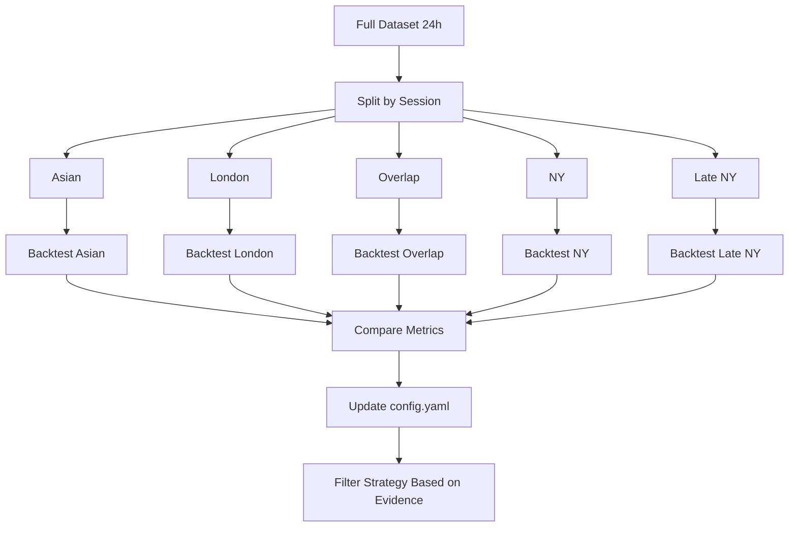

# EA_SCALPER_XAUUSD - Data Directory Structure

## 🎯 Purpose

Centralized data management for backtesting and analysis. **ONE config file to rule them all.**

This structure eliminates confusion about which dataset to use by maintaining a single source of truth in `config.yaml`.

## 📂 Directory Structure

```
data/
├── config.yaml                 ⭐ SINGLE SOURCE OF TRUTH
├── README.md                   📘 This file
│
├── raw/                        🔒 Original data (NEVER modify)
│   ├── xauusd_2020_2024_stride20_full.parquet
│   ├── xauusd_2020_2024_stride20_full.metadata.json
│   └── [future stride5, stride10...]
│
├── processed/                  🔧 Processed data for specific analyses
│   ├── by_session/            
│   │   ├── xauusd_2020_2024_stride20_asian.parquet
│   │   ├── xauusd_2020_2024_stride20_london.parquet
│   │   ├── xauusd_2020_2024_stride20_overlap.parquet
│   │   ├── xauusd_2020_2024_stride20_ny.parquet
│   │   └── xauusd_2020_2024_stride20_late_ny.parquet
│   │
│   ├── by_period/
│   │   ├── xauusd_2024_11_stride20_full.parquet
│   │   └── xauusd_2024_08_stride20_full.parquet
│   │
│   └── experimental/           🧪 Temporary test datasets (safe to delete)
│
└── versions/                   📦 Historical backups
    └── [old datasets when generating new versions]
```

## ⭐ config.yaml - Single Source of Truth

**ALL scripts MUST read this file** to know which dataset to use.

### Key Sections

1. **active_dataset**: Current dataset for backtesting
   - `path`: Location of the parquet file
   - `stats`: Total ticks, period, stride, file size
   - `session_coverage`: Distribution across trading sessions
   - `quality`: Validation status, density metrics

2. **session_performance**: Results from empirical session analysis
   - Initially `PENDING`
   - Updated after running session-specific backtests
   - Contains win rate, Sharpe, profit factor per session
   - Recommends which sessions to trade

3. **alternative_datasets**: Reference for session/period-specific data
   - Paths to processed datasets
   - Use cases for each dataset

4. **generation_settings**: Parameters for creating new datasets
   - Source CSV paths
   - Session hour definitions
   - Stride options

## 🔒 raw/ - Original Data (NEVER Modify)

Contains complete, unfiltered datasets from FTMO CSV sources.

**Rules:**
- ✅ Read-only after generation
- ✅ ALL sessions (24h coverage)
- ✅ Includes `.metadata.json` with generation info
- ❌ NEVER edit these files
- ❌ To update, regenerate and move old to `versions/`

**Naming Convention:**
```
{symbol}_{start_year}_{end_year}_stride{N}_full.parquet
```

Example: `xauusd_2020_2024_stride20_full.parquet`

## 🔧 processed/ - Processed Data

### by_session/

Datasets split by trading session for **empirical analysis**.

**Purpose:** Discover which sessions generate alpha (data-driven, not assumptions).

**Sessions (Eastern Time):**
- **Asian** (19:00-02:00 ET): Asian + Late Asian markets
- **London** (02:00-07:00 ET): London open
- **Overlap** (07:00-10:00 ET): London/NY overlap (traditionally best)
- **NY** (10:00-12:00 ET): NY session
- **Late NY** (12:00-16:00 ET): Late NY + market close

**Workflow:**
1. Generate session-specific parquets from `raw/`
2. Run backtest on each session independently
3. Compare: win rate, Sharpe, profit factor, DD
4. Update `config.yaml` with results
5. Filter strategy based on empirical evidence

### by_period/

Month or year-specific datasets for focused analysis.

**Use Cases:**
- Quick iteration testing (1 month vs 5 years)
- Recent market regime validation
- Specific event analysis (elections, COVID, etc.)

### experimental/

Temporary datasets for testing.

**Rules:**
- ✅ Safe to delete anytime
- ✅ Use for "what if" scenarios
- ❌ Never use for production validation
- ❌ Never reference in `config.yaml` as active_dataset

## 📦 versions/ - Historical Backups

Old datasets moved here when generating new versions.

**Retention Policy:**
- Keep 2 most recent versions
- Archive older versions (compress or delete)
- Document changes in `config.yaml` migration notes

## 🚀 Usage

### For Python Scripts

```python
import yaml
import pandas as pd
from pathlib import Path

# Load data config (ALWAYS start with this)
config = yaml.safe_load(open("data/config.yaml"))

# Get active dataset
data_path = Path(config["active_dataset"]["path"])
df = pd.read_parquet(data_path)

# Access metadata
stats = config["active_dataset"]["stats"]
print(f"Loaded {stats['total_ticks']:,} ticks")
print(f"Period: {stats['period_start']} to {stats['period_end']}")

# Check session coverage
coverage = config["active_dataset"]["session_coverage"]
print(f"London: {coverage['london']}%")
print(f"Overlap: {coverage['overlap']}%")
```

### For Backtest Scripts

```python
# run_backtest.py should read config.yaml
config = yaml.safe_load(open("data/config.yaml"))

# Use active dataset by default
default_data_path = config["active_dataset"]["path"]

# Allow override via CLI
parser.add_argument("--data", default=default_data_path)
```

### For Analysis Scripts

```python
# check_data_quality.py should read from config
config = yaml.safe_load(open("data/config.yaml"))
main_file = Path(config["active_dataset"]["path"])

# Validate and update config
stats = analyze_parquet(main_file)
# Update config.yaml with validation results
```

## 🔄 Workflow

### 1. Generate New Data

```bash
# From FTMO CSV sources
python scripts/generate_parquet.py --stride 20 --output data/raw/xauusd_2020_2024_stride20_full.parquet
```

### 2. Update config.yaml

```yaml
active_dataset:
  path: "data/raw/xauusd_2020_2024_stride20_full.parquet"
  stats:
    total_ticks: [update]
    period_start: [update]
    # ... etc
```

### 3. Move Old Data

```bash
# Backup old dataset
Move-Item data/raw/old_file.parquet data/versions/
```

### 4. Run Validation

```bash
python check_data_quality.py
# Script reads config.yaml, validates active_dataset
```

### 5. Backtest

```bash
python scripts/run_backtest.py
# Script auto-uses active_dataset from config.yaml
```

## ✅ Best Practices

### DO:
- ✅ **Always read `config.yaml`** for active dataset path
- ✅ Document new datasets in config with full stats
- ✅ Use `processed/experimental/` for temporary tests
- ✅ Validate after generating new data
- ✅ Update config when empirical analysis completes
- ✅ Backup to `versions/` before overwriting
- ✅ Keep `.metadata.json` with each parquet

### DON'T:
- ❌ Hardcode paths in scripts (`data/ticks/some_file.parquet`)
- ❌ Modify files in `raw/` (regenerate instead)
- ❌ Delete `raw/` files without backing up to `versions/`
- ❌ Assume file naming without checking `config.yaml`
- ❌ Filter data before empirical analysis (removes discovery opportunity)
- ❌ Use experimental datasets for production validation

## 🧠 Philosophy: Data-Driven Session Selection

### OLD Approach (Assumption-Based):
```python
# Hardcoded assumptions
if hour < 7 or hour > 17:  # Asian + Late NY
    skip_trading()  # Assume these are bad
```

**Problem:** What if Asian session actually generates alpha? We'll never know!

### NEW Approach (Empirical):
```python
# 1. Keep ALL data (24h)
# 2. Analyze each session independently
# 3. Measure: win rate, Sharpe, profit factor, DD
# 4. Make data-driven decisions

# After analysis, config.yaml tells us:
config["session_performance"]["best_sessions"]  # ["overlap", "ny"]
config["session_performance"]["worst_sessions"]  # ["asian", "late_ny"]
```

**Benefit:** Discover surprising patterns, avoid false assumptions.

## 📊 Session Analysis Workflow



## 🔧 Maintenance

### Weekly:
- Check disk space in `data/`
- Clean up `processed/experimental/` if >1GB

### Monthly:
- Archive old versions to compressed storage
- Validate active dataset stats vs actual file

### When Generating New Data:
1. Generate to `data/raw/` with `_full` suffix
2. Create `.metadata.json` with generation params
3. Run `check_data_quality.py` for validation
4. Update `config.yaml` with new stats
5. Move old dataset to `versions/`
6. Test scripts with new dataset
7. Commit config.yaml changes

## 🚨 Troubleshooting

### "Script can't find data file"
→ Check `config.yaml` active_dataset.path exists
→ Verify script reads config.yaml (not hardcoded path)

### "Wrong data being used in backtest"
→ Verify script loads from `config["active_dataset"]["path"]`
→ Check for hardcoded paths in script

### "Data quality concerns"
→ Run `python check_data_quality.py`
→ Compare stats vs `config.yaml` (should match)
→ Regenerate if corruption suspected

### "Need different stride or period"
→ Generate new dataset to `data/raw/`
→ Update `config.yaml` to point to new dataset
→ Backup old dataset to `versions/`

## 📝 Migration from Old Structure

Old structure had:
```
data/ticks/xauusd_2020_2024_stride20.parquet
data/ticks/filtered/  # Experimental filter (not needed)
```

New structure:
```
data/raw/xauusd_2020_2024_stride20_full.parquet  # Renamed with _full
data/config.yaml  # Single source of truth
```

**Migration completed:** 2025-12-08

**Scripts to update:**
- ✅ `check_data_quality.py` - Read from config.yaml
- ✅ `run_backtest.py` - Read from config.yaml
- ⏳ Other analysis scripts as needed

## 🎓 Learning from Past Mistakes

**Mistake:** Filtered data to 07:00-17:00 GMT before analyzing performance.

**Why Bad:** Can't discover if Asian/Late NY sessions are profitable if we remove them first!

**Lesson:** Keep full 24h data, analyze empirically, THEN filter based on evidence.

**New Rule:** `raw/` datasets ALWAYS include ALL sessions (24h).

## 📚 References

- Session definitions: `config.yaml` > `generation_settings.sessions`
- Active dataset stats: `config.yaml` > `active_dataset`
- Analysis results: `config.yaml` > `session_performance` (after completion)
- Generation scripts: `scripts/generate_parquet.py`
- Validation scripts: `check_data_quality.py`
