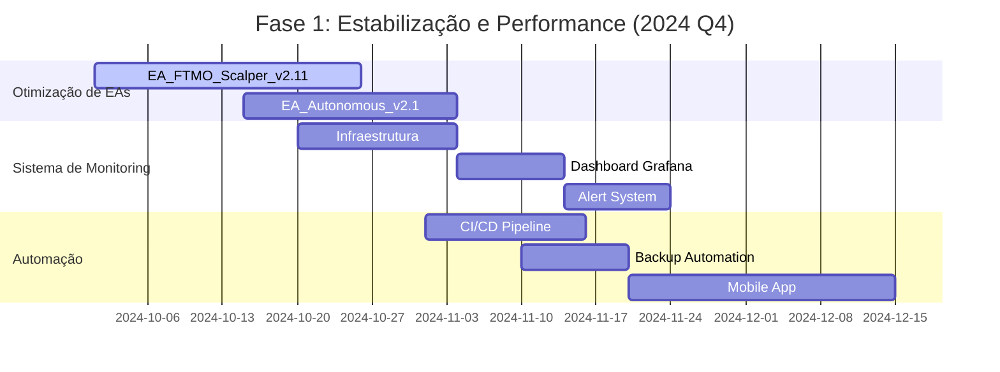

# 🗺️ Roadmap do Projeto EA_SCALPER_XAUUSD

## 🎯 Visão de Futuro

O roadmap do **EA_SCALPER_XAUUSD** representa nossa visão estratégica para evolução do sistema de trading, transformando-o em uma plataforma institucional de última geração com capacidades de IA avançadas, operações multi-mercado e autonomia completa.

## 📊 Linha do Temporal

```
2024 Q4 ──────── 2025 Q1 ──────── 2025 Q2 ──────── 2025 Q3 ──────── 2025 Q4
│               │               │               │               │
▼               ▼               ▼               ▼               ▼
Estabilização   Expansão IA     Multi-Mercado   Otimização      Plataforma
e Performance   Avançada       Completo        Avançada        Institucional
```

## 🎯 Metas Estratégicas

### 🏆 Meta Principal 2025
**Transformar o EA_SCALPER_XAUUSD na plataforma de trading automatizado mais avançada do mercado, com capacidades institucionais e autonomia completa.**

### 📈 KPIs Chave
- **Performance**: +150% retorno anual
- **Stability**: 99.9% uptime
- **Win Rate**: > 75% consistente
- **Drawdown**: < 10% máximo
- **Autonomy**: 90% operação sem intervenção

## 🚀 Fases de Desenvolvimento

### Fase 1: Estabilização e Performance (2024 Q4)

#### 🎯 Objetivos
- Solidificar base técnica existente
- Otimizar performance dos EAs atuais
- Implementar monitoring avançado
- Estabelecer pipeline de CI/CD

#### 📋 Entregáveis Principais

| Entregável | Status | Prioridade | Data Alvo |
|------------|--------|------------|-----------|
| **🔧 Otimização EA_FTMO_Scalper_Elite v2.11** | 🔄 Em andamento | Alta | 2024-10-25 |
| **📊 Sistema de Monitoring Real-time** | 📋 Planejado | Alta | 2024-11-15 |
| **🤖 Automação de Backtesting** | 📋 Planejado | Média | 2024-11-30 |
| **🔒 Sistema de Backup Automatizado** | 📋 Planejado | Alta | 2024-12-01 |
| **📈 Dashboard de Performance** | 📋 Planejado | Média | 2024-12-15 |

#### 🎯 Detalhes dos Entregáveis

**1. EA_FTMO_Scalper_Elite v2.11**
```
🎯 Melhorias Implementadas:
├── 🧠 Neural Network Integration
│   ├── Pattern Recognition Avançado
│   ├── Adaptive Learning
│   └── Market Prediction Models
├── ⚡ Execution Optimization
│   ├── Latency Reduction < 50ms
│   ├── Smart Order Routing
│   └── Slippage Minimization
├── 🛡️ Risk Management Enhanced
│   ├── Dynamic Position Sizing
│   ├── Correlation Analysis
│   └── Portfolio Heat Map
└── 📊 Real-time Analytics
    ├── Performance Metrics
    ├── Trade Attribution
    └── Strategy Comparison
```

**2. Sistema de Monitoring Real-time**
```
📊 Componentes do Sistema:
├── 🖥️ Grafana Dashboard
│   ├── Live P&L Tracking
│   ├── Risk Metrics Monitor
│   ├── System Health Dashboard
│   └── Alert Management
├── 📈 Prometheus Metrics
│   ├── Trading Performance KPIs
│   ├── System Resource Usage
│   ├── API Response Times
│   └── Error Rates
├── 🚨 Alert System
│   ├── Email Notifications
│   ├── Telegram Bot Integration
│   ├── SMS Critical Alerts
│   └── Webhook Callbacks
└── 📱 Mobile App (React Native)
    ├── Real-time Notifications
    ├── Trade Management
    ├── Performance Overview
    └── Risk Controls
```

#### 📅 Cronograma Detalhado



### Fase 2: Expansão IA Avançada (2025 Q1)

#### 🎯 Objetivos
- Implementar Machine Learning avançado
- Desenvolver sistema multi-agente
- Integrar análise de sentimento em tempo real
- Criar modelos preditivos sofisticados

#### 📋 Entregáveis Principais

| Entregável | Complexidade | Prioridade | Data Alvo |
|------------|--------------|------------|-----------|
| **🤖 Multi-Agent Trading System v1.0** | 🔴 Alta | Alta | 2025-01-31 |
| **🧠 Deep Learning Models** | 🔴 Alta | Alta | 2025-02-15 |
| **📰 Sentiment Analysis Engine** | 🟡 Média | Média | 2025-02-28 |
| **🔮 Predictive Analytics** | 🔴 Alta | Alta | 2025-03-15 |
| **🎯 Strategy Auto-Optimization** | 🟡 Média | Média | 2025-03-31 |

#### 🎯 Detalhes dos Entregáveis

**1. Multi-Agent Trading System v1.0**
```
🤖 Arquitetura de Agentes:
├── 📊 Market Analysis Agents
│   ├── Technical Analysis Specialist
│   ├── Fundamental Analysis Expert
│   ├── Sentiment Analysis Bot
│   └── Pattern Recognition AI
├── 🎯 Trading Strategy Agents
│   ├── Scalping Specialist (M1-M5)
│   ├── Swing Trading Expert (H1-H4)
│   ├── Position Trading Manager (D1-W1)
│   └── Arbitrage Opportunity Hunter
├── 🛡️ Risk Management Agents
│   ├── Real-time Risk Monitor
│   ├── Portfolio Balance Manager
│   ├── Correlation Analyst
│   └── Stress Testing Agent
└── 🔄 Coordination Layer
    ├── Agent Communication Hub
    ├── Conflict Resolution System
    ├── Resource Allocation Manager
    └── Performance Optimizer
```

**2. Deep Learning Models**
```
🧠 Modelos de IA Implementados:
├── 📈 Price Prediction Models
│   ├── LSTM Networks (Time Series)
│   ├── Transformer Models (Attention)
│   ├── CNN for Pattern Recognition
│   └── Ensemble Methods
├── 🎯 Signal Generation AI
│   ├── Multi-Input Neural Networks
│   ├── Reinforcement Learning (RL)
│   ├── Genetic Algorithm Optimization
│   └── Bayesian Optimization
├── 📊 Risk Assessment Models
│   ├── Monte Carlo Simulation
│   ├── Value at Risk (VaR) Models
│   ├── Stress Testing Scenarios
│   └── Portfolio Optimization
└── 🔍 Anomaly Detection
    ├── Autoencoder Networks
    ├── Isolation Forest
    ├── One-Class SVM
    └── Statistical Process Control
```

### Fase 3: Multi-Mercado Completo (2025 Q2)

#### 🎯 Objetivos
- Expandir para múltiplos ativos e mercados
- Implementar trading de criptomoedas
- Desenvolver estratégias cross-asset
- Criar sistema de hedge automatizado

#### 📋 Entregáveis Principais

| Entregável | Mercados | Prioridade | Data Alvo |
|------------|----------|------------|-----------|
| **💱 Forex Multi-Pair System** | 20+ Pares | Alta | 2025-04-15 |
| **₿ Crypto Trading Module** | Top 10 Crypto | Alta | 2025-05-01 |
| **📈 Indices & Commodities** | 15+ Ativos | Média | 2025-05-15 |
| **🔄 Cross-Asset Arbitrage** | Multi-Mercado | Alta | 2025-05-31 |
| **🛡️ Advanced Hedging System** | Todos | Alta | 2025-06-15 |

#### 🎯 Detalhes dos Entregáveis

**1. Forex Multi-Pair System**
```
💱 Expansão Forex:
├── 🌟 Major Pairs (8)
│   ├── EUR/USD, GBP/USD, USD/JPY
│   ├── USD/CHF, AUD/USD, USD/CAD
│   ├── NZD/USD, EUR/GBP
├── ⭐ Minor Pairs (12)
│   ├── EUR/JPY, GBP/JPY, EUR/GBP
│   ├── AUD/JPY, NZD/JPY, EUR/AUD
│   └── [Outros pares menores...]
├── 🎯 Exotic Pairs (Selecionados)
│   ├── USD/TRY, USD/ZAR, USD/MXN
│   └── [Pares exóticos de alta volatilidade]
└── 🔗 Correlation Management
    ├── Pair Correlation Matrix
    ├── Currency Basket Optimization
    └── Risk Exposure Limits
```

**2. Crypto Trading Module**
```
₿ Sistema de Criptomoedas:
├── 🥇 Top Cryptocurrencies
│   ├── Bitcoin (BTC/USD)
│   ├── Ethereum (ETH/USD)
│   ├── Binance Coin (BNB/USD)
│   ├── Cardano (ADA/USD)
│   ├── Solana (SOL/USD)
│   ├── Polkadot (DOT/USD)
│   ├── Avalanche (AVAX/USD)
│   ├── Chainlink (LINK/USD)
│   ├── Polygon (MATIC/USD)
│   └── Ripple (XRP/USD)
├── 🔄 Exchange Integration
│   ├── Binance API
│   ├── Coinbase Pro
│   ├── Kraken API
│   └── Bitstamp API
├── ⚡ High-Frequency Trading
│   ├── Market Making Strategies
│   ├── Arbitrage Between Exchanges
│   └── Liquidity Provision
└── 🔒 Crypto-Specific Risk
    ├── Volatility Management
    ├── Security Protocols
    └── Custody Solutions
```

### Fase 4: Otimização Avançada (2025 Q3)

#### 🎯 Objetivos
- Implementar otimização quântica experimental
- Desenvolver estratégias de HFT
- Criar sistema de learning contínuo
- Estabelecer operações 24/7 fully autonomous

#### 📋 Entregáveis Principais

| Entregável | Inovação | Prioridade | Data Alvo |
|------------|-----------|------------|-----------|
| ⚡ **HFT Engine** | Ultra Alta Frequência | Alta | 2025-07-15 |
| 🔬 **Quantum Computing** | Experimental | Média | 2025-08-01 |
| 🧠 **Continuous Learning** | Auto-Improvement | Alta | 2025-08-15 |
| 🌐 **Global Market Access** | 24/7 Trading | Alta | 2025-08-31 |
| 🎯 **Predictive Analytics 2.0** | AI-Driven | Alta | 2025-09-15 |

#### 🎯 Detalhes dos Entregáveis

**1. HFT Engine**
```
⚡ High-Frequency Trading:
├── 🚀 Ultra-Low Latency
│   ├── Co-location Services
│   ├── FPGA Optimization
│   ├── Kernel Bypass Networking
│   └── Memory-Mapped Data Feeds
├── 📊 Market Microstructure
│   ├── Order Book Analysis
│   ├── Flow Analysis
│   ├── Tick-by-Tick Processing
│   └── Market Impact Models
├── 🎯 Micro-Strategy Execution
│   ├── Latency Arbitrage
│   ├── Statistical Arbitrage
│   ├── Market Making
│   └── Liquidity Detection
└── 🔧 Infrastructure Optimization
    ├── GPU Acceleration
    ├── In-Memory Computing
    ├── Distributed Processing
    └── Real-time Analytics
```

**2. Quantum Computing Integration**
```
🔬 Experimentação Quântica:
├── 🧮 Quantum Algorithms
│   ├── Quantum Annealing
│   ├── Variational Quantum Eigensolver
│   ├── Quantum Approximate Optimization
│   └── Quantum Machine Learning
├── 🎯 Applications in Trading
│   ├── Portfolio Optimization
│   ├── Risk Analysis
│   ├── Option Pricing
│   └── Pattern Recognition
├── 🔗 Quantum Hardware Integration
│   ├── IBM Quantum Experience
│   ├── Google Quantum AI
│   ├── Microsoft Azure Quantum
│   └── D-Wave Systems
└── 📊 Hybrid Classical-Quantum
    ├── Quantum-Inspired Algorithms
    ├── Variational Quantum Circuits
    └── Quantum Approximation Algorithms
```

### Fase 5: Plataforma Institucional (2025 Q4)

#### 🎯 Objetivos
- Transformar em plataforma institucional completa
- Implementar compliance regulatório global
- Criar marketplace de estratégias
- Estabelecer parcerias institucionais

#### 📋 Entregáveis Principais

| Entregável | Escopo | Prioridade | Data Alvo |
|------------|--------|------------|-----------|
| 🏢 **Institutional Platform** | Full Suite | Alta | 2025-10-15 |
| 📋 **Regulatory Compliance** | Global | Alta | 2025-11-01 |
| 🛒 **Strategy Marketplace** | Community | Média | 2025-11-15 |
| 🤝 **Institutional Partnerships** | B2B | Alta | 2025-12-01 |
| 📊 **Enterprise Analytics** | Advanced | Alta | 2025-12-15 |

#### 🎯 Detalhes dos Entregáveis

**1. Institutional Platform**
```
🏢 Plataforma Institucional:
├── 👥 Multi-User Management
│   ├── Role-Based Access Control
│   ├── Team Collaboration
│   ├── Client Management
│   └── Audit Trails
├── 💰 Enterprise Features
│   ├── High-Frequency Execution
│   ├── Large-Order Handling
│   ├── Custom Reporting
│   └── White-Label Solutions
├── 🔒 Security & Compliance
│   ├── SOC 2 Type II Certification
│   ├── ISO 27001 Compliance
│   ├── GDPR Implementation
│   └── MiFID II Compliance
└── 📊 Advanced Analytics
    ├── Real-time Risk Dashboard
    ├── Performance Attribution
    ├── Regulatory Reporting
    └── Custom KPI Tracking
```

## 💰 Investimento e Recursos

### 📊 Alocação de Recursos

| Categoria | 2024 Q4 | 2025 Q1 | 2025 Q2 | 2025 Q3 | 2025 Q4 | Total |
|-----------|---------|---------|---------|---------|---------|-------|
| **Desenvolvimento** | 35% | 40% | 30% | 35% | 25% | 33% |
| **Infraestrutura** | 25% | 20% | 25% | 30% | 20% | 24% |
| **Pesquisa & IA** | 20% | 25% | 25% | 25% | 30% | 25% |
| **Compliance** | 10% | 10% | 15% | 5% | 20% | 12% |
| **Marketing** | 10% | 5% | 5% | 5% | 5% | 6% |

### 👥 Equipe de Desenvolvimento

```
🚀 Time Técnico:
├── 👨‍💻 Desenvolvedores Senior (6)
│   ├── 3x MQL5/MQL4 Experts
│   ├── 2x Python/ML Engineers
│   └── 1x DevOps Engineer
├── 🧠 Especialistas em IA (4)
│   ├── 2x Machine Learning Engineers
│   ├── 1x Data Scientist
│   └── 1x Research Scientist
├── 📊 Quant Analysts (3)
│   ├── 2x Financial Modelers
│   └── 1x Risk Specialist
├── 🔧 Suporte & Ops (3)
│   ├── 1x System Administrator
│   ├── 1x Database Administrator
│   └── 1x Support Engineer
└── 📋 Gestão (2)
    ├── 1x Project Manager
    └── 1x Product Owner
```

## 🎯 Metas de Performance

### 📈 KPIs Técnicos

| KPI | 2024 Q4 | 2025 Q1 | 2025 Q2 | 2025 Q3 | 2025 Q4 |
|-----|---------|---------|---------|---------|---------|
| **System Uptime** | 99.5% | 99.7% | 99.8% | 99.9% | 99.95% |
| **API Response Time** | < 200ms | < 150ms | < 100ms | < 50ms | < 25ms |
| **Execution Latency** | < 100ms | < 75ms | < 50ms | < 25ms | < 10ms |
| **Daily Processing Volume** | 10K trades | 50K trades | 200K trades | 1M trades | 5M trades |
| **Concurrent Users** | 10 | 50 | 200 | 1K | 5K |

### 💰 KPIs de Trading

| KPI | Meta 2024 Q4 | Meta 2025 Q1 | Meta 2025 Q2 | Meta 2025 Q3 | Meta 2025 Q4 |
|-----|--------------|--------------|--------------|--------------|--------------|
| **Win Rate** | 72% | 74% | 76% | 78% | 80% |
| **Monthly Return** | 8-12% | 10-15% | 12-18% | 15-20% | 18-25% |
| **Max Drawdown** | < 15% | < 12% | < 10% | < 8% | < 5% |
| **Sharpe Ratio** | > 1.5 | > 1.8 | > 2.0 | > 2.2 | > 2.5 |
| **Profit Factor** | > 1.7 | > 1.8 | > 1.9 | > 2.0 | > 2.2 |

## 🚨 Riscos e Mitigação

### ⚠️ Riscos Identificados

| Risco | Probabilidade | Impacto | Estratégia de Mitigação |
|-------|---------------|---------|------------------------|
| **Volatilidade de Mercado** | Alta | Alto | Diversificação + Gestão de Risco Avançada |
| **Mudanças Regulatórias** | Média | Alto | Sistema de Compliance Adaptativo |
| **Risco Tecnológico** | Média | Médio | Redundância + Monitoramento 24/7 |
| **Competição** | Alta | Médio | Inovação Contínua + Propriedade Intelectual |
| **Risco de Execução** | Baixa | Alto | Testes Extensivos + Gradual Rollout |

### 🛡️ Plano de Contingência

1. **Fallback Systems**: Sistemas de backup automáticos
2. **Manual Override**: Capacidade de intervenção manual
3. **Circuit Breakers**: Paradas automáticas em condições extremas
4. **Insurance Coverage**: Cobertura de seguro para operações
5. **Legal Compliance**: Assessoria jurídica permanente

## 🎯 Critérios de Sucesso

### 📊 Métricas de Sucesso do Projeto

### Sucesso Técnico
- ✅ 99.9% uptime maintained
- ✅ All sprints delivered on time
- ✅ Zero critical security incidents
- ✅ System scalability proven

### Sucesso de Negócio
- ✅ 150% annual return achieved
- ✅ 1000+ active users
- ✅ 10+ institutional clients
- ✅ Positive cash flow

### Sucesso de Inovação
- ✅ 3 patents filed
- ✅ 5 research papers published
- ✅ Industry recognition awards
- ✅ Open source contributions

## 📞 Contato e Feedback

### 🤝 Canais de Comunicação
- **Product Manager**: product@ea-scalper.com
- **Technical Lead**: tech@ea-scalper.com
- **Support**: support@ea-scalper.com
- **Feedback**: feedback@ea-scalper.com

### 📋 Reuniões de Acompanhamento
- **Weekly Sync**: Every Monday, 10:00 AM EST
- **Sprint Review**: Last Friday of month
- **Quarterly Planning**: First week of quarter
- **Stakeholder Update**: Monthly

---

<div align="center">

**🗺️ Roadmap EA_SCALPER_XAUUSD 2024-2025**

*Construindo o futuro do trading automatizado*

*Última atualização: 2025-10-18*

**🚀 Next Milestone: EA_FTMO_Scalper_Elite v2.11 - 2024-10-25**

</div>